# Build Site: gloggy

> Terminal UI tool for interactively analyzing JSONL log files.
> Go + Bubble Tea / Lip Gloss. Single binary, single file input.

## Summary

| Metric | Value |
|---|---|
| Source Kits | 6 domains |
| Requirements | 56 |
| Acceptance Criteria | 290 |
| Plan Tasks | 129 |
| Human Sign-off Tasks | 16 |
| Tiers | 14 (0 through 13) |

---

## Task Index

### Tier 0 -- No Dependencies (Start Here)

These tasks can all run in parallel. They establish the Go module, data models, and config foundation.

| Task | Title | Kit Req | Effort | Description |
|---|---|---|---|---|
| T-001 | Go module init and project scaffold | -- | S | `go mod init github.com/istonikula/gloggy`. Create directory layout: `cmd/gloggy/`, `internal/logsource/`, `internal/config/`, `internal/filter/`, `internal/ui/entrylist/`, `internal/ui/detailpane/`, `internal/ui/appshell/`, `internal/theme/`. Create `main.go` stub. |
| T-002 | Log entry data model | log-source/R3, R4 | S | Define `internal/logsource/entry.go`: `Entry` struct with fields `LineNumber int`, `IsJSON bool`, `Time time.Time`, `Level string`, `Msg string`, `Logger string`, `Thread string`, `Extra map[string]json.RawMessage`, `Raw []byte`. Raw text entries use `IsJSON=false` with `Raw` populated and structured fields zero-valued. |
| T-003 | Line classification | log-source/R2 | S | Implement `Classify(line []byte) LineType` in `internal/logsource/classify.go`. Valid JSON object -> JSONL; everything else (plain text, empty, JSON array, scalar) -> raw text. Unit tests for all 4 criteria. |
| T-004 | JSONL parser | log-source/R3, R5 | M | Implement `ParseJSONL(line []byte, lineNum int) Entry` in `internal/logsource/parse.go`. Extract `time` (RFC3339Nano), `level`, `msg`, `logger`, `thread`; remaining keys go to `Extra`. Preserve raw bytes. Flag as JSON. Handle unparseable/missing timestamps by leaving `Time` as zero value. Unit tests for all R3 and R5 criteria. |
| T-005 | Raw text entry constructor | log-source/R4 | S | Implement `NewRawEntry(line []byte, lineNum int) Entry` in `internal/logsource/parse.go`. Sets `Raw`, `IsJSON=false`, `LineNumber`. All structured fields absent/zero. Unit tests for R4 criteria. |
| T-006 | Config file location and defaults | config/R1 | M | Implement `internal/config/config.go`: `Config` struct with all fields (theme, compact row fields, sub-row fields, hidden fields, logger depth, detail pane height ratio). Default creation at `~/.config/gloggy/config.toml` using `os.UserConfigDir`. Load existing. Use `pelletier/go-toml` or `BurntSushi/toml`. Unit tests for R1 criteria. |
| T-007 | Invalid config handling | config/R2 | S | In config loader: catch TOML parse errors -> warn + use defaults. Catch invalid field values -> per-field fallback. Never crash. Unit tests for R2 criteria. |
| T-008 | Config forward compatibility | config/R3 | S | Use TOML library that preserves unknown keys on round-trip. Test: load config with unknown keys, save, verify unknown keys remain. Unit tests for R3 criteria. |
| T-009 | Theme definitions | config/R4 | M | Implement `internal/theme/theme.go`: `Theme` struct with color tokens for level badges (error, warn, info, debug), syntax highlighting (key, string, number, boolean, null), marks, dim, search highlight. Bundle `tokyo-night`, `catppuccin-mocha`, `material-dark`. Default is `tokyo-night`. Unknown theme falls back with warning. Lip Gloss `lipgloss.Color` values. Unit tests for R4 criteria (except human sign-off). |
| T-010 | Config field and display settings | config/R5 | S | Wire default values: compact row fields = [time, level, logger, msg], logger depth = 2, detail pane height = 0.30. Override from config. Unit tests for R5 criteria. |
| T-011 | Filter model | filter-engine/R1 | S | Implement `internal/filter/filter.go`: `Filter` struct with `Field string`, `Pattern string`, `Mode` (include/exclude), `Enabled bool`. `FilterSet` holds multiple filters; individual enable/disable without delete. Unit tests for R1 criteria. |
| T-012 | Entry-list scroll navigation keys | entry-list/R5 | S | Implement scroll commands as standalone functions: `GoTop`, `GoBottom`, `HalfPageDown`, `HalfPageUp`. These are pure logic (cursor + viewport offset calculation) independent of Bubble Tea. Unit tests for R5 criteria. |
| T-013 | Entry-list marks model | entry-list/R9 | S | Implement mark storage: `MarkSet` backed by `map[int]bool` (line number keyed). Toggle, query, next/prev with wrap. Unit tests for R9 criteria (mark/unmark, next/prev/wrap). |
| T-014 | Help overlay content | app-shell/R5 | S | Define keybinding registry: map of domain -> list of (key, description). This is a data structure, no TUI rendering yet. Content for all domains. |

### Tier 1 -- Depends on Tier 0

| Task | Title | Kit Req | blockedBy | Effort | Description |
|---|---|---|---|---|---|
| T-015 | File reader | log-source/R1 (file path) | T-002, T-003, T-004, T-005 | M | Implement `internal/logsource/reader.go`: open file, scan lines, classify each, parse accordingly, emit `[]Entry`. Return error for nonexistent file before any UI. Unit tests for R1 file-path criterion and R6 order/line-number criteria. |
| T-016 | Stdin reader | log-source/R1 (stdin) | T-002, T-003, T-004, T-005 | S | Implement stdin variant: detect piped stdin via `os.Stdin.Stat()`, scan lines, classify+parse. Unit test for R1 stdin criterion. |
| T-017 | Entry ordering and line numbers | log-source/R6 | T-015 | S | Verify in `reader.go` that entries are emitted line 1..N, line numbers match position, interleaved JSON/raw preserve order. Add integration test with mixed-content file. |
| T-018 | Pattern matching | filter-engine/R2 | T-002, T-011 | M | Implement `Match(filter Filter, entry Entry) bool` in `internal/filter/match.go`. Literal = substring, regex = RE2 via `regexp`. Invalid regex -> error, filter not applied. Match against msg, level, logger, thread, extra field keys. Unit tests for all R2 criteria. |
| T-019 | Include/exclude logic | filter-engine/R3 | T-011, T-018 | M | Implement `Apply(filters FilterSet, entries []Entry) []int` returning passing entry indices. Include/exclude/combined/disabled logic. Unit tests for all 5 R3 criteria. |
| T-020 | Filtered entry index | filter-engine/R7 | T-019 | S | Implement `FilteredIndex` type: stores passing entry indices in original order. Recompute on filter change. Unit tests for R7 criteria (correct entries, order, recompute). |
| T-021 | Logger abbreviation | entry-list/R2 | T-010 | S | Implement `AbbreviateLogger(name string, depth int) string` in `internal/ui/entrylist/logger.go`. Dot-separated segments; abbreviate all but last `depth` segments to first char. Unit tests for all 4 R2 criteria. |
| T-022 | Compact row renderer | entry-list/R1 | T-002, T-009, T-021 | M | Implement `RenderCompactRow(entry Entry, width int, theme Theme, config Config) string` in `internal/ui/entrylist/row.go`. JSONL: HH:MM:SS time, level, abbreviated logger, truncated msg. Raw: raw text. Zero time -> placeholder. Use Lip Gloss for styling. Unit tests for R1 criteria (except human sign-off for dim styling). |
| T-023 | Level badge colors | entry-list/R3 | T-009, T-022 | S | Apply theme color tokens to level badges in compact row renderer. Verify ANSI output contains correct color codes per level per theme. Unit tests for R3 criteria (except human sign-off). |
| T-024 | Config live write-back | config/R6 | T-006, T-008 | M | Implement `WriteField(key string, value interface{})` that updates the TOML file in place, preserving other values and unknown keys. Unit tests for R6 criteria. |
| T-025 | Config extensibility | config/R7 | T-008 | S | Verify that adding new top-level key does not break existing schema. Write test: future version adds key, current version reads without error. Unit tests for R7 criteria. |
| T-026 | Global filter toggle | filter-engine/R6 | T-011 | S | Implement `ToggleAll(set *FilterSet)` that disables/re-enables all filters. Track per-filter prior state. Unit tests for all 3 R6 criteria. |

### Tier 2 -- Depends on Tier 1

| Task | Title | Kit Req | blockedBy | Effort | Description |
|---|---|---|---|---|---|
| T-027 | Background loading with progress | log-source/R7 | T-015 | M | Refactor file reader into goroutine-based loader. Send entries in batches via channel. Emit progress signals (count loaded so far). Emit done signal on exhaustion. UI can start displaying before full load. Use `tea.Cmd` pattern for Bubble Tea integration. Unit/integration tests for R7 criteria. |
| T-028 | Tail mode | log-source/R8 | T-015, T-017 | M | Implement file watcher using `fsnotify` or `hpcloud/tail`. Append new lines as new entries with correct continuing line numbers. Disable tail mode for stdin regardless of flags. Unit tests for R8 criteria. |
| T-029 | Virtual list model | entry-list/R6 | T-022 | M | Implement virtual rendering in `internal/ui/entrylist/list.go`: only render visible rows + small buffer. Maintain viewport window (start index, visible count). Benchmark: 100k entries must not exceed visible+buffer rows; frame render < 16ms. Tests for R6 criteria. |
| T-030 | Two-level cursor navigation | entry-list/R4 | T-022, T-010 | M | Implement cursor model: event level (j/k) and sub-row level (l/h/Tab/Esc/arrows). Sub-rows indented, showing field name + value. j/k skip sub-rows. Visual boundary for entries with sub-row fields. Unit tests for R4 criteria (except human sign-off). |
| T-031 | Filtered view in entry list | entry-list/R7 | T-020, T-029 | M | Wire filtered index into list model. Hidden entries not rendered. On filter change: keep selection if still passing, else move to nearest. Unit tests for R7 criteria. |
| T-032 | Level-jump navigation | entry-list/R8 | T-020, T-029 | M | Implement `e`/`E` (next/prev ERROR) and `w`/`W` (next/prev WARN) navigation. Search full entry set (not just filtered). Wrap with indicator. Show filtered-out entries with visual indicator when jumped to. Unit tests for R8 criteria (except human sign-off). |
| T-033 | Mark navigation in list | entry-list/R9 | T-013, T-029 | S | Wire `MarkSet` into list model. `m` toggles mark, visual indicator on row. `u`/`U` for next/prev mark with wrap indicator. Unit tests for mark display and navigation. |
| T-034 | Entry selection signal | entry-list/R10 | T-029 | S | Emit selection signal (entry data) when cursor moves. This is a `tea.Msg` in Bubble Tea. Unit test for R10 cursor-move criterion. |
| T-035 | JSON pretty-print with syntax highlighting | detail-pane/R2 | T-002, T-009 | M | Implement `RenderJSON(entry Entry, theme Theme, hiddenFields []string) string` in `internal/ui/detailpane/render.go`. Indent JSON, apply Lip Gloss color tokens per value type (key, string, number, boolean, null). All fields including extras. Theme switch changes colors. Unit tests for R2 criteria (except human sign-off). |
| T-036 | Non-JSON detail display | detail-pane/R3 | T-002 | S | Implement `RenderRaw(entry Entry) string`. Plain text, no JSON formatting. Unit tests for R3 criteria. |
| T-037 | Detail pane scrolling | detail-pane/R4 | T-035 | S | Implement scroll model for detail pane content: j/k scroll, mouse wheel scroll, stop at top/bottom. Uses Bubble Tea `viewport` component from Bubbles. Unit tests for R4 criteria. |
| T-038 | Per-field visibility | detail-pane/R5 | T-024, T-035 | M | Read hidden fields from config, omit from render. Toggle triggers re-render. Write visibility change to config via write-back. After restart, hidden fields stay hidden. Integration tests for R5 criteria. |
| T-039 | Filter panel overlay | filter-engine/R5 | T-011, T-026 | M | Implement `internal/ui/filter/panel.go` as Bubble Tea model. List all filters with field, pattern, mode, enabled state. j/k navigation, Space toggle, d delete. Changes immediately update filtered index. Mouse navigable. Unit tests for R5 criteria. |

### Tier 3 -- Depends on Tier 2

| Task | Title | Kit Req | blockedBy | Effort | Description |
|---|---|---|---|---|---|
| T-040 | Entry list mouse handling | entry-list/R10 | T-029, T-034 | M | Click to select entry row. Scroll wheel scrolls list. Double-click opens detail pane. Route mouse events via `tea.MouseMsg`. Unit tests for R10 mouse criteria. |
| T-041 | Detail pane activation and dismissal | detail-pane/R1 | T-034, T-035 | M | Enter on selected entry opens detail pane. Double-click opens detail pane. Esc or Enter in detail pane closes it, returns focus to entry list. Bubble Tea focus management. Unit tests for R1 criteria. |
| T-042 | Detail pane height and resize | detail-pane/R6 | T-010, T-037 | M | Open at configured height ratio. `+`/`-` adjust height. Terminal resize maintains proportional height. Mouse drag on divider resizes. Unit tests for R6 criteria. |
| T-043 | In-pane search | detail-pane/R7 | T-037, T-009 | M | `/` opens search input in detail pane. Type to highlight matches using theme search-highlight color. `n`/`N` for next/prev match. Wrap indicator. Esc dismisses + clears. Does not affect entry-list filter. Unit tests for R7 criteria. |
| T-044 | Add filter from field value | filter-engine/R4 | T-039, T-041 | M | From detail pane field click: pre-fill field name and pattern. User chooses include/exclude. On confirm, filter added to set, filtered index updated. Unit tests for R4 criteria. |
| T-045 | Mouse filter interaction in detail pane | detail-pane/R8 | T-044 | M | Click on field value in detail pane triggers filter prompt with pre-filled field/value. Choose include/exclude. Confirm adds filter. Unit tests for R8 criteria. |
| T-046 | App-shell layout | app-shell/R2 | T-029, T-041 | M | Implement `internal/ui/appshell/layout.go`. Header bar top, entry list main area, detail pane between list and status bar when open, status/key-hint bar at bottom. Full terminal width/height, no gaps. Lip Gloss `lipgloss.JoinVertical`. Unit tests for R2 criteria. |
| T-047 | Header bar | app-shell/R3 | T-027, T-028, T-020, T-046 | M | Render file name (or stdin indicator), `[FOLLOW]` badge for tail mode, total entry count, visible (filtered) count. Counts update on load/filter change. Unit tests for R3 criteria. |
| T-048 | Loading indicator | app-shell/R8 | T-027, T-046 | S | Show loading indicator during background load (entry count so far). Hide when done. Unit tests for R8 criteria. |

### Tier 4 -- Depends on Tier 3

| Task | Title | Kit Req | blockedBy | Effort | Description |
|---|---|---|---|---|---|
| T-049 | Entry points and CLI | app-shell/R1 | T-015, T-016, T-028, T-046 | M | Implement `cmd/gloggy/main.go`: `gloggy <file>`, `gloggy -f <file>` (tail), piped stdin detection. Invalid args -> clear error. Use `pflag` or stdlib `flag`. Unit tests for R1 criteria. |
| T-050 | Context-sensitive key-hint bar | app-shell/R4 | T-046, T-039, T-041 | M | Render bottom bar showing keybindings for focused component (entry list, detail pane, filter panel). Update immediately on focus change. Unit tests for R4 criteria. |
| T-051 | Help overlay | app-shell/R5 | T-014, T-046 | M | `?` opens full-screen overlay listing all keybindings by domain. Esc closes. While open, other keys are not processed. Bubble Tea model with intercept. Unit tests for R5 criteria. |
| T-052 | Mouse mode and routing | app-shell/R6 | T-040, T-042, T-046 | M | Enable mouse mode in Bubble Tea. Route mouse events by area: entry list, detail pane, divider. No crashes on any mouse position. Unit tests for R6 criteria. |
| T-053 | Terminal resize handling | app-shell/R7 | T-046, T-042 | M | Handle `tea.WindowSizeMsg`. Re-layout all panes to new dimensions. Preserve pane proportions. No clipping, overlap, crash. Unit tests for R7 criteria. |
| T-054 | Clipboard | app-shell/R9 | T-013, T-046 | M | `y` with marked entries copies to system clipboard. JSONL format: one entry per line, original order. Non-JSON as raw text. No marks -> no-op. Use `atotto/clipboard`. Unit tests for R9 criteria. |

### Tier 5 -- Integration and Polish

| Task | Title | Kit Req | blockedBy | Effort | Description |
|---|---|---|---|---|---|
| T-055 | Entry list + filter engine wiring | entry-list/R7, filter-engine/R7 | T-031, T-039 | M | Integration test: create entries, apply filters, verify list shows only passing entries. Filter change updates list. Selection preserved or moved to nearest. |
| T-056 | Detail pane + filter engine wiring | detail-pane/R8, filter-engine/R4 | T-045, T-044 | M | Integration test: click field in detail pane, verify filter prompt appears, confirm, verify filter active and list updated. |
| T-057 | Background loading + UI wiring | log-source/R7, app-shell/R8 | T-027, T-048 | M | Integration test: load large file, verify progress updates in header, entries appear incrementally, done signal hides indicator. |
| T-058 | Tail mode + UI wiring | log-source/R8, app-shell/R3 | T-028, T-047 | M | Integration test: start in tail mode, append lines to file, verify new entries appear, line numbers continue, FOLLOW badge shown. |
| T-059 | Config write-back round trip | config/R6, detail-pane/R5 | T-038, T-024 | M | Integration test: hide field in detail pane, verify config file updated, restart, verify field still hidden. |
| T-060 | Full app smoke test | all | T-049 through T-054 | L | End-to-end test: launch gloggy with sample JSONL file, navigate list, open detail, apply filter, mark entries, copy clipboard, resize terminal. Verify no panics. |

### Tier 6 -- Human Sign-off

| Task | Title | Kit Req | blockedBy | Effort | Description |
|---|---|---|---|---|---|
| T-061 | [HUMAN] Theme visual sign-off: tokyo-night | config/R4, entry-list/R3, detail-pane/R2 | T-023, T-035, T-060 | S | Human visually inspects tokyo-night theme. All color tokens produce coherent, readable output. Level badges perceptually correct. Syntax highlighting perceptually correct. |
| T-062 | [HUMAN] Theme visual sign-off: catppuccin-mocha | config/R4, entry-list/R3, detail-pane/R2 | T-023, T-035, T-060 | S | Same as T-061 for catppuccin-mocha. |
| T-063 | [HUMAN] Theme visual sign-off: material-dark | config/R4, entry-list/R3, detail-pane/R2 | T-023, T-035, T-060 | S | Same as T-061 for material-dark. |
| T-064 | [HUMAN] Non-JSON row dim styling | entry-list/R1 | T-022, T-060 | S | Human verifies non-JSON rows are visually dimmed compared to JSONL rows. |
| T-065 | [HUMAN] Event boundary clarity | entry-list/R4 | T-030, T-060 | S | Human verifies event boundaries are visually clear and readable. |
| T-066 | [HUMAN] Filtered-out entry indicator | entry-list/R8 | T-032, T-060 | S | Human verifies the "filtered-out but visible" indicator from level-jump is clearly distinguishable. |
| T-067 | [HUMAN] Mark wrap indicator visibility | entry-list/R9 | T-033, T-060 | S | Human verifies mark/level-jump wrap indicators are visible and clear. |
| T-068 | [HUMAN] Detail pane syntax highlighting per theme | detail-pane/R2 | T-061, T-062, T-063 | S | Covered by T-061/T-062/T-063. This is a tracking entry confirming all three themes pass. |

### Tier 7 -- Code Review Fixes

Bug fixes and hardening from full codebase review (2026-04-16).

| Task | Title | Kit Req | blockedBy | Effort | Description |
|---|---|---|---|---|---|
| T-069 | Guard nil Extra map in filter match | filter-engine/R2 | T-018 | S | `internal/filter/match.go:34` — accessing `entry.Extra[field]` panics when `Extra` is nil. Add `if entry.Extra == nil { return "", false }` before the map lookup. Add test with nil-Extra entry. |
| T-070 | Check scanner.Err() after Scan loops | log-source/R1, R7, R8 | T-015, T-027, T-028 | S | Three locations silently drop I/O errors: `reader.go` `scanEntries()`, `loader.go` `streamEntries()`, `tail.go` both scan loops. Check `scanner.Err()` after each loop and propagate or log the error. Add tests for mid-read I/O failure. |
| T-071 | Cache compiled regexes in filter | filter-engine/R2 | T-018 | S | `internal/filter/match.go:50-55` — `regexp.Compile(pattern)` is called on every `Match()` invocation. Cache the compiled regex (e.g. in a `sync.Map` or on the `Filter` struct). Add benchmark proving improvement. |
| T-072 | Cache visibleCount during loading | app-shell/R2 | T-046 | S | `internal/ui/app/model.go:332` — `visibleCount()` calls `filter.Apply()` on every `EntryBatchMsg`, resulting in O(n²) work during background loading. Cache the count; invalidate on filter change. |
| T-073 | Add cancellation to TailFile | log-source/R8 | T-028 | M | `internal/logsource/tail.go:29-77` — the goroutine, file handle, and fsnotify watcher leak if the caller stops consuming messages. Accept a `context.Context` or stop channel; close watcher and file on cancellation. Add test verifying cleanup after cancel. |
| T-074 | Fix ToggleAll with modified filter set | filter-engine/R6 | T-026 | S | `internal/filter/filter.go:120-139` — if filters are added or removed while `globallyDisabled == true`, `savedEnabled` goes out of sync. Either track per-filter saved state by ID, or sync `savedEnabled` in `Add()`/`Remove()`. Add test: add filter while globally disabled, re-enable, verify correct state. |
| T-075 | Use theme Mark color in list rendering | entry-list/R9 | T-033 | S | `internal/ui/entrylist/list.go:354` — mark indicator uses plain `"* "` string instead of `th.Mark` color. Apply `lipgloss.NewStyle().Foreground(th.Mark)` to the mark indicator. The `Mark` color is defined in all 3 themes but currently unused. |
| T-076 | Fix double-click detection in entry list | entry-list/R10 | T-040 | M | `internal/ui/entrylist/list.go:273-289` — current code opens the detail pane on any click to an already-selected row (single-click-on-cursor), not actual double-click. Either implement timestamp-based double-click detection, or remove the click-to-open path and require Enter. |
| T-077 | Proper JSON string unquoting in filter match | filter-engine/R2 | T-018 | S | `internal/filter/match.go:40-42` — naive `s[1:len(s)-1]` doesn't handle JSON escape sequences (`\"`, `\\`, `\n`). Use `json.Unmarshal` into a `string` for correct unquoting. Add test with escaped quotes in field value. |

### Tier 8 -- Visual Polish (Cursor, Header, Focus, Borders)

New tasks from 2026-04-16 kit revision. All prior tiers are complete; these address UI gaps found during manual testing.

| Task | Title | Kit Req | blockedBy | Effort | Description |
|---|---|---|---|---|---|
| T-078 | Add theme tokens: CursorHighlight, HeaderBg, FocusBorder | config/R4 | T-009 | S | Add three new fields to `Theme` struct in `internal/theme/theme.go`: `CursorHighlight lipgloss.Color` (background for selected row), `HeaderBg lipgloss.Color` (header bar background), `FocusBorder lipgloss.Color` (accent color for focused pane border). Define appropriate values for all 3 bundled themes (tokyo-night, catppuccin-mocha, material-dark). Unit tests: verify each theme defines non-empty values for all three new tokens. |
| T-079 | Cursor row highlight in entry list | entry-list/R1 | T-078, T-022, T-029 | M | In `internal/ui/entrylist/list.go` `View()`, apply `lipgloss.NewStyle().Background(th.CursorHighlight).Width(m.width)` to the row where the cursor is. The highlight must span the full row width. Unit test: render a list, verify the cursor row's ANSI output contains the CursorHighlight color as background. Human sign-off: cursor row is clearly distinguishable. |
| T-080 | Expose cursor position from list model | entry-list/R11 | T-029 | S | Add `CursorPosition() int` method to `ListModel` returning 1-based index of the cursor within the visible (filtered) entry set. Update on cursor move and filter change. Unit tests: verify position after j/k, g/G, and after filter change. |
| T-081 | Header bar styling and cursor position display | app-shell/R3 | T-078, T-047, T-080 | M | In `internal/ui/appshell/header.go`: (1) Apply `lipgloss.NewStyle().Background(th.HeaderBg).Bold(true).Width(m.width)` to the header. (2) Add `WithCursorPos(pos int)` method. (3) Display cursor position as `{pos}/{visible}` alongside existing counts. Unit tests: verify header ANSI output contains HeaderBg color; verify cursor position renders correctly. Human sign-off: header is clearly distinguishable from log lines. |
| T-082 | Detail pane top border/separator | detail-pane/R1 | T-078, T-041 | S | In `internal/ui/detailpane/model.go` `View()`, prepend a horizontal rule or top border line using `lipgloss.NewStyle().Border(lipgloss.NormalBorder()).BorderTop(true).BorderForeground(th.FocusBorder)` (or equivalent). The separator visually divides the entry list from the detail pane. Unit test: verify pane View output starts with a border character. Human sign-off: boundary is clearly visible. |
| T-083 | Focus indicator on panes | app-shell/R10 | T-078, T-046, T-041 | M | When the detail pane is open, indicate which pane (entry list vs detail pane) is focused. Options: (a) render a colored left border on the focused pane using `th.FocusBorder`, (b) show a title bar on the focused pane. The indicator must update immediately when focus changes (Enter to open pane, Esc to close). Unit tests: render with focus on detail pane, verify focus indicator present; switch focus, verify indicator moves. Human sign-off: focused pane is identifiable at a glance. |

### Tier 9 -- Details-Pane Redesign (2026-04-17)

Foundational model + theme extensions, right-split layout, focus cycle, resize keymap, wrap / width awareness. Driven by the 2026-04-17 kit revision after DESIGN.md was authored. Prior tiers remain intact.

| Task | Title | Kit Req | blockedBy | Effort | Description |
|---|---|---|---|---|---|
| T-084 | Extend Theme with DividerColor + UnfocusedBg tokens | config/R4 | T-009, T-078 | S | Add `DividerColor lipgloss.Color` and `UnfocusedBg lipgloss.Color` fields to `Theme` in `internal/theme/theme.go`. Define non-empty values for all three bundled themes (tokyo-night, catppuccin-mocha, material-dark). Per DESIGN.md §2, `DividerColor` reads quiet-neutral (closer to `Dim` than to `FocusBorder`) and `UnfocusedBg` is a subtle background tint distinct from `Dim` (which is a foreground). Unit tests: each theme returns non-empty values for both new tokens; values are distinct from `Dim` and `FocusBorder`. **Design Ref:** DESIGN.md §2. |
| T-085 | Extend Config with detail_pane orientation keys | config/R5 | T-006, T-010 | S | Extend `Config` in `internal/config/config.go` with `DetailPane.Position string` (default `"auto"`), `DetailPane.OrientationThresholdCols int` (default `100`), `DetailPane.WidthRatio float64` (default `0.30`), `DetailPane.WrapMode string` (default `"soft"`). Add validation: invalid `position` falls back to `"auto"`; invalid numeric values fall back to defaults (per R2 behavior). Unit tests: default file contains all four keys; overrides round-trip; invalid values fall back. **Design Ref:** DESIGN.md §5 config schema additions. |
| T-086 | Preserve height_ratio and width_ratio independently in Config | config/R5 | T-085, T-024 | S | In `internal/config/config.go` + write-back: ensure `DetailPane.HeightRatio` and `DetailPane.WidthRatio` are stored and persisted as separate keys. A write-back to one must not mutate or null the other. Unit test: set height_ratio=0.50, write-back, re-read; width_ratio unchanged. Same test in the reverse direction. **Design Ref:** DESIGN.md §5 Ratios (independent preservation). |
| T-087 | Orientation selector model with auto-flip | app-shell/R7 | T-085, T-053 | M | Add `internal/ui/appshell/orientation.go` exposing `SelectOrientation(width int, cfg Config) Orientation` returning `OrientationBelow` or `OrientationRight`. Rules: explicit `position = "below"` or `"right"` returns that value (subject to minimum-viable checks); `"auto"` returns `right` when `width >= orientation_threshold_cols`, else `below`. Wire the selector into `ResizeModel` / `LayoutModel` so orientation is re-evaluated on every `tea.WindowSizeMsg`. Unit tests: threshold boundary, forced modes, re-eval on resize. **Design Ref:** DESIGN.md §5 orientation modes. |
| T-088 | Right-split composition with divider and border accounting | app-shell/R2 | T-046, T-084, T-087 | L | Extend `internal/ui/appshell/layout.go` with a right-split branch. When `Orientation == OrientationRight`, the main area is composed via `lipgloss.JoinHorizontal(Top, listView, dividerView, detailView)` between the header and the status bar. Width allocation MUST subtract both pane borders (2 cells each = 4) plus the 1-cell divider before multiplying by `width_ratio`: `usable := termWidth - 4 - 1; listW := int(float64(usable)*(1.0 - widthRatio)); detailW := usable - listW`. Follow the code sample in DESIGN.md §5 verbatim. Unit tests: given termWidth=120 and widthRatio=0.30, listW and detailW sum with chrome to exactly 120 (verified via `lipgloss.Width`). **Design Ref:** DESIGN.md §5 Border accounting, §7 DO example. |
| T-089 | Divider renderer (1-cell vertical glyph) | app-shell/R2 | T-084, T-088 | S | Implement `RenderDivider(height int, theme Theme) string` in `internal/ui/appshell/divider.go`. Returns `height` rows of a single `│` character, foreground `DividerColor`. Divider does **not** recolor on focus change. Unit tests: output width is exactly 1 cell per row (verified with `lipgloss.Width`); output height matches input; color matches `theme.DividerColor`. **Design Ref:** DESIGN.md §4.5. |
| T-090 | Minimum-viable terminal floor (60x15) fallback | app-shell/R2 | T-046, T-053 | S | In `internal/ui/appshell/layout.go` top-level render: when `termWidth < 60` OR `termHeight < 15`, suppress normal rendering and draw a centered `terminal too small` message (single line or brief stack) using `lipgloss.Place(width, height, Center, Center, msg)`. Normal render resumes automatically once dimensions recover. Unit test: at 59x15 and 60x14 output contains the fallback message and no panels; at 60x15 normal render resumes. **Design Ref:** DESIGN.md §8. |
| T-091 | Detail pane auto-close on minimum underflow + status notice | app-shell/R7 | T-087, T-088, T-042 | M | In `ResizeModel` / `LayoutModel`: after computing pane dimensions, if orientation is `right` and the computed detail width < 30 cells, OR orientation is `below` and the computed detail height < 3 rows, auto-close the detail pane and emit a one-time status-bar notice (e.g. `detail pane auto-closed — terminal too small`). The notice replaces the key hints for ~3 seconds, then restores them. Unit tests: resize below threshold closes the pane and produces the notice; resize back above threshold does not re-open the pane. **Design Ref:** DESIGN.md §4.4 (min dimensions), §8 adaptive rules. |
| T-092 | Key-hint bar focus label (right side) | app-shell/R4 | T-050, T-084, T-096 | S | In `internal/ui/appshell/keyhints.go`: when more than one pane is visible, append to the right side of the status bar a focus label reading `focus: list`, `focus: details`, or `focus: filter`. Render with Bold + `FocusBorder` foreground. Omit the label when only one pane is visible (list alone). The label right-aligns; hints remain on the left and are truncated if they would collide. Unit tests: three-focus-state renderings include correct label text and ANSI codes; single-pane state omits the label. **Design Ref:** DESIGN.md §3 type roles (status bar focus label), §4.6, §6 tertiary cue. |
| T-093 | Header narrow-mode degradation + source ellipsis | app-shell/R3 | T-047, T-081 | M | In `internal/ui/appshell/header.go`: before rendering, measure component widths using `lipgloss.Width`. If the total would exceed terminal width, drop components in order: focus label → entry counts (`<visible>/<total> entries`) → cursor position (`<cursorPos>/<visible>`) → FOLLOW badge. Source is always kept; if alone it overflows, truncate with `…` (use `lipgloss.Width`-based truncation, not byte length). Unit tests: progressively narrow widths drop components in the specified order; 10-col width still shows a truncated source with `…`. **Design Ref:** DESIGN.md §4.1 (degradation order), §8 header degradation. |
| T-094 | Mouse horizontal zones in right-split with divider buffer | app-shell/R6 | T-052, T-088 | M | In `internal/ui/appshell/mouse.go`: when orientation is right-split, partition the main area horizontally into three zones — entry list (columns `[borderL .. listEnd]`), divider column (1 cell), detail pane (columns `[detailStart .. borderR]`). Header and status bar remain separate horizontal zones as today. Add a 1-cell buffer on each side of the divider where clicks are NOT routed to either pane (prevents mis-routing on the chrome). Mouse drag on the divider column triggers width-ratio resize (horizontal drag in right mode). Unit tests: click at `(listEnd, row)` is ignored (buffer); click at `(listEnd - 1, row)` routes to list; click at `(detailStart + 1, row)` routes to detail. **Design Ref:** DESIGN.md §5 Border accounting, §6 focus model. |
| T-095 | Click-to-focus on panes | app-shell/R6, R11 | T-094, T-052 | S | In `internal/ui/appshell/mouse.go` click handler: after the target pane has processed the click (selection, etc.), also emit a `FocusMsg{Target: pane}` so focus transfers to that pane. Applies in both orientations — clicking inside the list focuses the list; clicking inside the detail pane focuses details. Clicks outside any pane are no-ops for focus. Unit test: click at detail-pane coords when list focused produces a FocusMsg targeting details; focus state updates. **Design Ref:** DESIGN.md §6 focus model (mouse click focuses). |
| T-096 | Tab focus cycle between visible panes | app-shell/R11 | T-046, T-041, T-039, T-051 | M | Add `internal/ui/appshell/focus.go` with `NextFocus(current FocusTarget, visible []FocusTarget, overlayOpen bool) FocusTarget`. Rules: if any overlay is open (filter panel or help), `Tab` is inert and focus stays where it is. Otherwise Tab cycles through the visible panes in order: list → details (when open) → list. Never closes a pane on Tab. Wire the function into the top-level `app-shell` model's `Update` handler. Unit tests: list+details both visible, Tab flips focus; filter overlay open, Tab is a no-op; single pane (list alone), Tab is a no-op. **Design Ref:** DESIGN.md §6 focus model + §9 keymap matrix (Tab). |
| T-097 | Esc context-sensitive dismissal | app-shell/R11 | T-041, T-051, T-039, T-043 | M | In the top-level app-shell `Update`: on `Esc`, apply priority: (1) if any overlay (filter panel or help) is open, close the overlay only and consume the key; (2) else if the detail pane is focused, close the pane and return focus to the list (T-041 already does this, just ensure Tab-close-free semantics); (3) else if the list is focused, clear transient state (active search, mark-nav wrap indicator) if present, otherwise no-op. Ensure Tab never closes a pane (enforce in T-096 too). Unit tests: each branch individually and in sequence. **Design Ref:** DESIGN.md §6 focus model (Esc priority). |
| T-098 | Ratio keymap handler (\|/+/-/=/clamp) | app-shell/R12 | T-042, T-088, T-087 | M | Add `internal/ui/appshell/ratiokeys.go` with an `Update` integration routing keys: `\|` cycles presets `[0.10, 0.30, 0.70]` in order; `+` adds 0.05 to the active ratio; `-` subtracts 0.05; `=` resets the active ratio to `0.30`. Active ratio is `height_ratio` in below-mode and `width_ratio` in right-mode (selected via the orientation model from T-087). All adjustments clamp to `[0.10, 0.80]` (inclusive). Changes must update the in-memory layout model AND call a write-back hook (see T-099). Unit tests: pressing `+` three times from 0.30 produces 0.45; from 0.80 is no-op; pressing `\|` cycles the three presets; below vs right modes address different fields. **Design Ref:** DESIGN.md §5 Ratio keymap, §9 keymap matrix. |
| T-099 | Ratio live write-back to config | app-shell/R12, config/R6 | T-098, T-024, T-086 | S | Wire the T-098 handler's write-back hook to `config.WriteField`: writes `detail_pane.height_ratio` in below mode, `detail_pane.width_ratio` in right mode. Writes happen on every ratio change so the new value survives a restart. Ensure the other ratio is not touched (relies on T-086). Unit/integration test: change ratio in below mode, verify config file updated with new height_ratio and unchanged width_ratio; repeat in right mode. **Design Ref:** DESIGN.md §5 (persistence implicit), kit R12 AC 7. |
| T-100 | Unfocused-pane visual state (DividerColor + UnfocusedBg + Dim fg) | app-shell/R10 | T-084, T-083, T-088 | M | Update pane render paths in `internal/ui/entrylist/list.go` and `internal/ui/detailpane/model.go`: when a pane is unfocused-but-visible, render with `DividerColor` for ALL borders (left/right/top/bottom — not just the left), set background to `UnfocusedBg`, and blend the foreground toward `Dim` (e.g. apply `lipgloss.NewStyle().Faint(true)` on the rendered body or swap the style base). Must NOT alter rendered dimensions (no post-render border wrapping). Unit tests: render entry list with focus on detail pane — verify list border color == `DividerColor`, background contains `UnfocusedBg` ANSI, outer width/height unchanged from focused state; repeat with list focus, verifying detail pane uses unfocused treatment. **Design Ref:** DESIGN.md §4 matrix, §6 focus cues. |
| T-101 | Alone-pane uses focused treatment | app-shell/R10 | T-100, T-083 | S | In the pane renderer: when a pane is the sole visible pane (detail pane closed => list is alone), it uses the focused treatment — `FocusBorder` borders, base background, full contrast foreground. Do not apply unfocused treatment to a solitary pane. Unit tests: close detail pane, verify the list renders with FocusBorder borders and base background regardless of internal focus flag. **Design Ref:** DESIGN.md §4 matrix (Alone row). |
| T-102 | Cursor row always rendered when list unfocused | entry-list/R1, app-shell/R10 | T-079, T-100 | S | In `internal/ui/entrylist/list.go` `View()`: the cursor row is always rendered with `CursorHighlight` background — even when the list is unfocused-but-visible. When unfocused, reduce intensity: non-Bold weight and (per DESIGN.md §4 matrix) the `CursorHighlight` at a perceptually reduced level. Focused state keeps Bold + full CursorHighlight. Unit tests: with focus=list verify cursor row Bold + full bg; with focus=details verify cursor row non-Bold + CursorHighlight bg still present. **Design Ref:** DESIGN.md §4 matrix (cursor row cross-cutting), §6 tertiary cue #4. |
| T-103 | Detail pane top border in both orientations | detail-pane/R1, app-shell/R10 | T-082, T-088 | S | Extend the existing T-082 border logic to explicitly verify the top border renders in BOTH `below` and `right` orientations. In right mode the top border of the detail pane must appear at the top of the pane column (not dropped due to `JoinHorizontal` interactions). Add unit tests: render the detail pane in each orientation and assert the first line of the pane's View output contains the border glyph using `lipgloss.Width`-safe scanning. **Design Ref:** DESIGN.md §4.4 (top border visible in both), §6 border conventions. |
| T-104 | Detail pane width resize in right orientation | detail-pane/R6 | T-042, T-088, T-098 | M | Extend `internal/ui/detailpane/height.go` (rename logically to size.go) to accept both dimensions. In right orientation the pane opens at `width_ratio` (default 0.30) and the `+`/`-`/`\|`/`=` keys from T-098 adjust `width_ratio` instead of `height_ratio`. Mouse drag on the vertical divider in right mode resizes the pane width (horizontal delta). Unit tests: open in right mode at width 120 with width_ratio=0.30, pane width ≈ 0.30*usable; pressing `+` once increases width_ratio by 0.05; mouse drag handler updates width_ratio by horizontal pixel delta normalized to terminal width. **Design Ref:** DESIGN.md §5 Ratios, kit detail-pane R6. |
| T-105 | Orientation flip preserves both ratios | app-shell/R7, detail-pane/R6 | T-086, T-087, T-104 | S | In the orientation-flip path (triggered from T-087 on WindowSizeMsg or from T-098 on `position` change): ensure flipping `below → right` does NOT overwrite `width_ratio` with `height_ratio` (or vice versa). Both ratios live independently in the model AND in config. Unit test: load config with height_ratio=0.60, width_ratio=0.20, flip orientation both ways, verify neither value mutated. **Design Ref:** DESIGN.md §5 Ratios (independent preservation), kit app-shell R7 AC 7. |
| T-106 | Detail pane soft wrap | detail-pane/R9 | T-037, T-085, T-107 | M | Implement soft wrap in `internal/ui/detailpane/render.go` (or a new `wrap.go`): when a rendered content line exceeds the pane's content width, wrap at the pane width. Use width-safe measurement (T-107). No silent hard truncation — if content is wider than the line budget, it wraps onto the next line. Wrapped total height must not exceed the allocated pane height; overflow is handled by the existing scroll model (T-037). When `wrap_mode = "soft"` (the shipping default) this path is active; `wrap_mode = "scroll"` and `"modal"` remain out of scope per kit. Unit tests: a long-string field wraps at the pane width; scroll works across wrapped lines; total rendered height ≤ allocated height. **Design Ref:** DESIGN.md §4.4 (open, soft-wrap), §7 don't-hard-truncate. |
| T-107 | Detail pane width-safe measurement (emoji/CJK/ANSI) | detail-pane/R10 | T-035, T-088 | M | Replace any byte-length-based measurement in the detail pane with `lipgloss.Width` (which internally handles emoji, CJK, and ANSI-escape-safe measurement via `go-runewidth` under the hood). Audit `internal/ui/detailpane/*.go` for `len(...)` usages on rendered strings and swap them for `lipgloss.Width`. Ensure the pane's outer width equals the allocated width. Unit tests: render a line containing `🔥`, `日本語`, and ANSI-styled substrings; measured width equals expected cell-count; pane does not overflow its allocated width. **Design Ref:** DESIGN.md §7 DO #1 / DON'T #1, kit detail-pane R10. |
| T-108 | Terminal resize extension: re-eval orientation + preserve ratios | app-shell/R7 | T-053, T-087, T-105 | S | Extend `internal/ui/appshell/resize.go` `ResizeModel` so every `tea.WindowSizeMsg` re-invokes `SelectOrientation` from T-087 and passes both ratios through unchanged. Ensure resize does not clobber `height_ratio` or `width_ratio` (delegates to T-105). Add unit test: simulate a window that shrinks from 120 to 90 cols with `position = "auto"`, verify the model flips from `right` to `below` and both ratios remain at their configured values. **Design Ref:** DESIGN.md §8 adaptive rules, kit app-shell R7 ACs 6-7. |

### Tier 10 -- Human Sign-off (Visual State Matrix)

| Task | Title | Kit Req | blockedBy | Effort | Description |
|---|---|---|---|---|---|
| T-109 | [HUMAN] DividerColor + UnfocusedBg visual sign-off | config/R4 | T-084, T-088, T-100, T-060 | S | Human visually verifies — across all three bundled themes — that (1) `DividerColor` reads as a quiet neutral hue (closer to `Dim` than to `FocusBorder`, never dominant), and (2) `UnfocusedBg` is a subtle background tint that dims without erasing content. Confirm the divider column in right-split does not recolor on focus change. **Design Ref:** DESIGN.md §2 new tokens. |
| T-110 | [HUMAN] Pane visual-state matrix sign-off | app-shell/R10 | T-100, T-101, T-102, T-103, T-088, T-060 | S | Human visually verifies the DESIGN.md §4 matrix: focused pane uses `FocusBorder` border + base bg + full-contrast fg; unfocused-but-visible pane uses `DividerColor` border + `UnfocusedBg` bg + `Dim`-blend fg; an alone pane uses the focused treatment; the cursor row remains visible (at reduced intensity) when the list is unfocused; the detail pane top border is visible in both orientations. **Design Ref:** DESIGN.md §4 matrix. |

### Tier 11 -- Gap Remediation (discovered during sign-off)

| Task | Title | Kit Req | blockedBy | Effort | Description |
|---|---|---|---|---|---|
| T-111 | Render wrap indicator on level-jump and mark-nav | entry-list/R8, R9 | T-032, T-033 | S | `internal/ui/entrylist/list.go` `View()` does not render any visual indicator when `wrapDir != NoWrap`. Acceptance criteria R8 #6 ("when a wrap occurs, an indicator is shown") and R9 #5 ("mark navigation wraps with an indicator") are not met. The state is tracked (`wrapDir`, `HasTransient()`, `WrapDir()`) but only consumed by Esc-clear in `app/model.go:324`. Render a transient marker (e.g., `↻` glyph or "wrapped" notice) when `WrapDir() != NoWrap`, cleared by `ClearTransient()` (already wired to Esc + next nav). Re-verify via tui-mcp: 2 marks → `u` past end → wrap indicator visible. |
| T-112 | Render filtered-out indicator when level-jump lands outside filter | entry-list/R8 | T-032, T-019 | S | When level-jump (`e`/`E`/`w`/`W`) lands on an entry excluded by the active filter set, the entry is shown but no visual indicator distinguishes it as outside the current filter. Acceptance criteria R8 #7 ("entry is shown and a visual indicator communicates it is outside the current filter") and R8 #8 (human readability) are not met. Decide on indicator (e.g., a leading `⌀` or per-row badge) and render it when the cursor's underlying entry index is not in the current `FilteredIndex`. Re-verify via tui-mcp: filter to INFO → press `e` → cursor jumps to filtered-out ERROR → indicator visible. |

### Tier 12 -- Search Integration (discovered by /ck:check 2026-04-18)

Triggered by user report "pressing / does nothing". Root cause: `detailpane/model.go` `View()` never consumes `SearchModel`; `/` from entry-list focus falls through to a dead branch. Addresses cavekit-detail-pane R7 (expanded) and new cavekit-app-shell R13. Tasks are ordered so T-113 unblocks the rest.

| Task | Title | Kit Req | blockedBy | Effort | Description |
|---|---|---|---|---|---|
| T-113 | Expose unstyled content lines from PaneModel | detail-pane/R7 | T-043, T-106 | S | Add `func (m PaneModel) ContentLines() []string` that returns the soft-wrapped, un-bordered, un-syntax-styled content currently fed into `style.Render(content)` in `internal/ui/detailpane/model.go`. Do not split the post-`View()` string — splitting the bordered output includes top/bottom border rows and ANSI SGR codes, shifting match indices by 1 and corrupting highlight composition (see F-003). Unit test: `ContentLines()` returns exactly the wrapped raw lines with no border characters and no ANSI escapes. Used by T-114 as the search match source. |
| T-114 | Wire SearchModel into PaneModel render path | detail-pane/R7 | T-113 | M | Give `PaneModel` a `WithSearch(SearchModel) PaneModel` setter and have `View()` call `search.HighlightLines(contentLines)` before `style.Render`. Prepend a search prompt row inside the bordered pane when `search.IsActive()`: `"/" + query + "  (" + current+1 + "/" + total + ")"` — when `query != "" && MatchCount() == 0` render `"No matches"` instead. Include a wrap glyph (e.g. `↻` / `↺`) when `WrapDir() != SearchNoWrap`. In `internal/ui/app/model.go`, replace `lines := strings.Split(m.pane.View(), "\n")` (line 298) with `lines := m.pane.ContentLines()`, and after `paneSearch.Update` call `m.pane = m.pane.WithSearch(m.paneSearch)`. Integration test: activate search, type query, assert the composed app `View()` contains the prompt line, `(c/t)` counter, and ANSI highlight bytes on matching lines. Closes F-002, F-003, F-004, F-010. |
| T-115 | Scroll viewport to current match on n/N | detail-pane/R7 | T-114 | S | Add `func (m PaneModel) ScrollToLine(line int) PaneModel` (scroll so `line` is visible within the current viewport). After `paneSearch.Update` in `internal/ui/app/model.go`, when `msg.String() == "n"` or `"N"`, call `m.pane = m.pane.ScrollToLine(m.paneSearch.CurrentMatchLine())`. Unit test with a 50-line content + pane height 10: sequential `n` presses keep the current match visible. Closes F-005. |
| T-116 | Cross-pane `/` activation from entry-list focus | app-shell/R13 | T-114 | S | In `internal/ui/app/model.go` `handleKey` default (`FocusEntryList`) branch, intercept `msg.String() == "/"` before forwarding to `m.list.Update`: (a) if `m.pane.IsOpen()`, set `m.focus = FocusDetailPane`, call `m.paneSearch, _ = m.paneSearch.Update(msg, m.pane.ContentLines())` so search activates on the same keypress; (b) if pane closed, `m.keyhints = m.keyhints.WithNotice("Open an entry first (Enter)")` with the 3s `tea.Tick` auto-clear used by T-091. Unit tests: `/` with pane open transfers focus and sets `paneSearch.IsActive() == true`; `/` with pane closed leaves focus on list and sets `keyhints.HasNotice() == true`. Closes F-001. |
| T-117 | Dismiss search on pane close / re-open | detail-pane/R7 | T-114 | S | In `internal/ui/app/model.go`: on receipt of `detailpane.BlurredMsg` (pane close) call `m.paneSearch = m.paneSearch.Dismiss()`; in `openPane()` also dismiss before opening a different entry. Unit test: open pane, activate search, type `hi`, press Esc-Esc to close pane, reopen pane, press `j` — assert `paneSearch.IsActive() == false` and `j` routes to pane scroll (not to query). Closes F-006. |
| T-118 | Split search input-mode vs navigation-mode | detail-pane/R7 | T-114 | M | In `internal/ui/detailpane/search.go` introduce an `inputMode bool` field: `Activate` sets it `true`; Enter commits the query and sets it `false` (search stays "active" for highlight purposes but no longer consumes keystrokes as runes); `/` re-enters input mode. In `Update`, only append runes when `inputMode == true`; when in navigation mode, only `n`, `N`, Esc, `/` are intercepted — `j`, `k`, `g`, `G`, `Ctrl+d`, `Ctrl+u` pass through to the pane scroll model. Route from `internal/ui/app/model.go` accordingly. Unit tests: active-search `j` in input-mode appends to query; active-search `j` in navigation-mode does not appear in query and pane scrolls. Closes F-008. |
| T-119 | UTF-8-safe backspace in search query | detail-pane/R7 | T-043 | S | In `internal/ui/detailpane/search.go:181-184`, replace `m.query = m.query[:len([]rune(m.query))-1]` with `runes := []rune(m.query); m.query = string(runes[:len(runes)-1])`. Unit test: query `"café"` backspace → `"caf"`; query `"日本語"` backspace → `"日本"`; query `"🚀x"` backspace → `"🚀"`. Closes F-009. |
| T-120 | Two-step Esc integration test for search + pane | detail-pane/R7 | T-114, T-117 | S | Add an integration test in `tests/integration/` (or extend `detailpane_filter_test.go`): open pane, activate search, press Esc — assert `paneSearch.IsActive() == false` AND `pane.IsOpen() == true`; press Esc again — assert `pane.IsOpen() == false`. Prevents regressions if anyone reorders the key-route branches in `app/model.go`. Closes F-007. |
| T-121 | Update help overlay + keyhint bar for `/` scope | app-shell/R13 | T-116 | S | In `internal/ui/appshell/help.go`, rewrite the `/` entry under `DomainDetailPane` to `{Key: "/", Desc: "Search inside detail pane — opens pane if closed"}`. In `internal/ui/appshell/keyhints.go` add a `/` hint to the `FocusEntryList` hint set when `m.pane.IsOpen()` (via a new `WithPaneOpen(bool)` method mirroring `WithNotice`), with text like `/ search pane`; when pane closed, show `/ search (open entry first)`. Unit tests assert the hint set depends on pane-open state. Closes F-011. |
| T-122 | [HUMAN] `/` search end-to-end sign-off | detail-pane/R7, app-shell/R13 | T-114, T-115, T-116, T-117, T-118, T-121 | S | Per overview "Verification Conventions" §1–§5, verify via tui-mcp on `logs/small.log` across all three bundled themes at `80x24` + `140x35` in both right and below orientations: (1) with list focused and pane closed, `/` shows the "open entry first" notice which auto-dismisses; (2) with list focused and pane open, `/` immediately activates search in the detail pane in one keypress; (3) typing a matching query shows `(cur/total)` counter and highlights matches in the theme's `SearchHighlight` color; (4) typing a non-matching query shows "No matches"; (5) `n`/`N` scroll the pane viewport so the current match is visible, with wrap indicator on wrap; (6) Esc once dismisses search, Esc again closes pane; (7) re-opening a different entry starts with search dismissed. Attach theme + geometry + orientation observations to impl-detail-pane.md Notes. |

### Tier 13 -- Detail-Pane Nav + Height + Focus Remediation (discovered by /ck:check 2026-04-18)

Triggered by user report: "only portion of content visible even if space below (tiny.log:34) / no cursor position / no g/G / no need to autofocus on details". Root causes spread across four independent bugs: pane vertical height uses below-mode `height_ratio` in right orientation (P0 clipping), scroll key set limited to `j`/`k`, no scroll-position indicator, pane open unconditionally steals focus. Addresses cavekit-detail-pane R1/R4/R6 (expanded) and cavekit-app-shell R11 (expanded). T-123 must land first — it is the P0 content-loss fix.

| Task | Title | Kit Req | blockedBy | Effort | Description |
|---|---|---|---|---|---|
| T-123 | Fix detail-pane vertical height in right orientation (P0) | detail-pane/R6, app-shell/R2, R7 | T-088, T-106 | M | Root cause of content being clipped on tiny.log:34 in right-split: `internal/ui/app/model.go` WindowSizeMsg branch (~line 162) and `relayout()` (~lines 523-536) size the detail pane via `m.paneHeight.PaneHeight()` which returns `int(terminalHeight * heightRatio)` — the below-mode vertical ratio. In right orientation the pane's visual slot is the full main area (`l.Height - l.HeaderHeight - l.StatusBarHeight`) but the pane's internal `m.height` is clamped to ~30% of terminal height. Fix: add `func DetailPaneVerticalRows(l Layout) int` in `internal/ui/appshell/layout.go` that returns `l.DetailPaneHeight` in below-mode and `l.Height - l.HeaderHeight - l.StatusBarHeight` in right-mode. Call `m.pane = m.pane.SetHeight(DetailPaneVerticalRows(l))` in BOTH the WindowSizeMsg branch (after layout compute) and at the end of `relayout()`. Also fix adjacent issues in the same codepath: `internal/ui/detailpane/model.go` `SetWidth` (~line 53) passes outer `m.height` to `m.scroll.SetContent(..., m.height)` — change to `m.ContentHeight()`; `View()` (~line 256-261) mutates `m.scroll.height` without re-clamping — add `m.scroll = m.scroll.Clamp()` (or make `clamp` public) after height change. Unit tests: right-orientation 80x24 terminal → pane `ContentHeight()` ≥ 20; below-orientation 80x24 → pane height ≈ `int(24 * 0.30)` (≈ 7); ratio change via `+`/`-` in below-mode still works; orientation flip to right uses full slot; orientation flip back to below restores previous height_ratio. Closes F-013 (P0), F-014 (P1), F-018 (P2), F-019 (P2), F-022 (P3). |
| T-124 | Add full vim-style scroll navigation to detail pane | detail-pane/R4 | T-037 | S | In `internal/ui/detailpane/scroll.go` `Update()` (~line 74), the switch only handles `j`/`down`/`k`/`up` and the mouse wheel. Extend with: `"g","home"` → `m.offset = 0`; `"G","end"` → `m.offset = max(0, len(m.lines) - m.height); m.clamp()`; `"pgdown","ctrl+d"," "` (space) → `m.ScrollDown(max(1, m.height-1))`; `"pgup","ctrl+u","b"` → `m.ScrollUp(max(1, m.height-1))`. Ensure clamp catches both ends. Unit tests: 50-line content, pane height 10 → `g` sets offset to 0; `G` sets offset to 40 (last line = line 50 visible at bottom); `pgdown` from top sets offset to 9; `pgup` from top is no-op (already at top); `pgup` after `G` returns toward top by height-1. Do NOT bind these in search-input mode — route only when pane has focus and `!paneSearch.IsInputMode()` (already enforced by T-118 split). Closes F-015 (P1). |
| T-125 | Render scroll-position indicator in detail pane | detail-pane/R4 | T-123, T-124 | M | In `internal/ui/detailpane/model.go` `View()` path (after content rendering, before border wrap), compute position: `total := len(contentLines); visible := min(m.ContentHeight(), total - m.scroll.Offset()); top := m.scroll.Offset(); bottom := top + visible`. If `total <= m.ContentHeight()`, omit the indicator. Otherwise render one of: (a) a `NN%` suffix right-aligned on the last visible content row (dim style from theme), OR (b) a 1-column scrollbar glyph in the rightmost content column showing the thumb position (filled block ▐ for the visible range, light ░ elsewhere). Preferred: (a) for simplicity; defer (b) to a future polish task. Use `theme.Dim` for the indicator color. Indicator must NOT add rows/columns to the pane's rendered dimensions — it composes within the allocated content area (write to the last row's tail or reserve one column in the soft-wrap width). Update DESIGN.md §4.4 in T-128. Unit tests: 200-line content, pane height 20, offset 0 → indicator shows `1-20/200` or `10%`; offset at max → indicator shows end marker; 5-line content, pane height 20 → no indicator rendered. Closes F-016 (P1). |
| T-126 | Remove auto-focus on pane open; add Esc-from-list closes pane | detail-pane/R1, app-shell/R11 | T-041 | S | In `internal/ui/app/model.go` `openPane()` (~lines 512-521), remove the `m.focus = appshell.FocusDetailPane` assignment — opening the pane no longer steals focus. Verify selection-change signals already re-render the pane with the new entry (they do via the existing `SelectedEntryMsg` flow). In `handleKey()` `FocusEntryList` branch, add a new case that fires BEFORE the list receives the key: `if msg.String() == "esc" && m.pane.IsOpen() { m.pane = m.pane.Close(); return m, nil }` — this covers R11 AC "Esc from list with pane open closes the pane". Update unit tests in `internal/ui/app/model_test.go`: after `openPane`, `m.focus == FocusEntryList` (not FocusDetailPane); with pane open + list focused, Esc closes the pane; with pane open + list focused, Tab transfers to pane; with pane open + list focused, clicking on pane zone transfers to pane (existing test should still pass). Closes F-017 (P1), F-024 (P3). |
| T-127 | Wire visibility.HiddenFields() into PaneModel.Open (R5 compliance) | detail-pane/R5 | T-038, T-041 | S | In `internal/ui/detailpane/model.go` `Open()` (~line 77-89) the call is `content = RenderJSON(entry, m.th, nil)` — `hiddenFields` is hardcoded to nil, so config-driven field hiding never reaches the pane even though `RenderJSON` supports it and `VisibilityModel.HiddenFields()` is populated in the app model. Add `func (m PaneModel) WithHiddenFields(hidden []string) PaneModel` (stores slice); `Open` reads `m.hiddenFields` when calling `RenderJSON`. In `internal/ui/app/model.go` `openPane()` and the visibility-toggle handler, call `m.pane = m.pane.WithHiddenFields(m.visibility.HiddenFields())` before `Open`. On visibility toggle while pane is open, re-call `Open(currentEntry, hiddenFields)` or add a `Rerender()` method that preserves scroll offset. Unit tests: hidden field is absent from pane content after Open; toggling visibility while pane open re-renders without the field; scroll offset preserved across re-render. Closes F-020 (P2). |
| T-128 | Update DESIGN.md §4.4 and §9 keymap for nav + indicator | design-system | T-124, T-125 | S | DESIGN.md §4.4 "Detail Pane" does not mention a scroll-position indicator; §9 keymap matrix lists only `j`/`k` for scroll. Add: §4.4 subsection "Scroll position feedback" describing the `NN%` (or `N-M/T`) suffix approach — right-aligned on last content row, `theme.Dim` foreground, omitted when content fits viewport, must not alter pane dimensions; §9 table rows for `g`/`G`/PgUp/PgDn/Home/End/Ctrl+d/Ctrl+u/Space/`b` under the "Detail pane" column. Also note in §6 "Focus model" that opening a pane does NOT transfer focus (link to app-shell R11). Log the change to `context/designs/design-changelog.md`. Closes F-021 (P2). |
| T-129 | [HUMAN] Detail-pane nav + height + focus end-to-end sign-off | detail-pane/R1, R4, R6, app-shell/R11 | T-123, T-124, T-125, T-126, T-127, T-128 | S | Per overview "Verification Conventions" §1–§5, verify via tui-mcp across all three bundled themes at `80x24` + `140x35` in BOTH orientations using `logs/tiny.log` as the reproducer: (1) open `logs/tiny.log`, cursor to line 34 (the 200+ field JSON config entry), press Enter → pane opens and shows top of JSON; list retains focus (try `j`/`k` → list cursor moves and pane content updates live with new entry); (2) in right orientation on 80x24, confirm the pane content area fills the full main slot (≥ 20 rows) — not clipped to ~30%; (3) Tab to the pane, press `G` → jumps to end of content in one keystroke; `g` → jumps to top; PgDn/PgUp → pages by viewport-1; scroll-position indicator visible and updates on each scroll, shows `100%` (or end marker) at bottom and omitted on short content like line 1-5 entries; (4) open a different entry, confirm indicator resets and content re-renders; (5) Esc once with pane focused closes pane and returns to list; Esc from list-focus with pane open also closes pane; (6) visibility toggle (mouse click on a field) hides the field immediately in the rendered pane. Attach theme + geometry + orientation observations to impl-detail-pane.md Notes. |

---

## Dependency Graph

```mermaid
graph LR
    T-001 --> T-015
    T-001 --> T-016
    T-002 --> T-015
    T-002 --> T-016
    T-002 --> T-018
    T-002 --> T-022
    T-002 --> T-035
    T-002 --> T-036
    T-003 --> T-015
    T-003 --> T-016
    T-004 --> T-015
    T-004 --> T-016
    T-005 --> T-015
    T-005 --> T-016
    T-006 --> T-024
    T-006 --> T-007
    T-007 --> T-024
    T-008 --> T-024
    T-008 --> T-025
    T-009 --> T-022
    T-009 --> T-023
    T-009 --> T-035
    T-009 --> T-043
    T-010 --> T-021
    T-010 --> T-030
    T-010 --> T-042
    T-011 --> T-018
    T-011 --> T-019
    T-011 --> T-026
    T-011 --> T-039
    T-013 --> T-033
    T-013 --> T-054
    T-014 --> T-051
    T-015 --> T-017
    T-015 --> T-027
    T-015 --> T-028
    T-015 --> T-049
    T-016 --> T-049
    T-017 --> T-028
    T-018 --> T-019
    T-019 --> T-020
    T-020 --> T-031
    T-020 --> T-032
    T-020 --> T-047
    T-021 --> T-022
    T-022 --> T-023
    T-022 --> T-029
    T-022 --> T-030
    T-024 --> T-038
    T-024 --> T-059
    T-026 --> T-039
    T-027 --> T-047
    T-027 --> T-048
    T-027 --> T-057
    T-028 --> T-047
    T-028 --> T-049
    T-028 --> T-058
    T-029 --> T-031
    T-029 --> T-032
    T-029 --> T-033
    T-029 --> T-034
    T-029 --> T-040
    T-029 --> T-046
    T-034 --> T-040
    T-034 --> T-041
    T-035 --> T-037
    T-035 --> T-038
    T-035 --> T-041
    T-037 --> T-042
    T-037 --> T-043
    T-038 --> T-059
    T-039 --> T-044
    T-039 --> T-050
    T-039 --> T-055
    T-040 --> T-052
    T-041 --> T-042
    T-041 --> T-044
    T-041 --> T-046
    T-041 --> T-050
    T-042 --> T-052
    T-042 --> T-053
    T-044 --> T-045
    T-044 --> T-056
    T-045 --> T-056
    T-046 --> T-047
    T-046 --> T-048
    T-046 --> T-049
    T-046 --> T-050
    T-046 --> T-051
    T-046 --> T-052
    T-046 --> T-053
    T-046 --> T-054
    T-047 --> T-058
    T-048 --> T-057
    T-031 --> T-055
    T-049 --> T-060
    T-050 --> T-060
    T-051 --> T-060
    T-052 --> T-060
    T-053 --> T-060
    T-054 --> T-060
    T-055 --> T-060
    T-056 --> T-060
    T-057 --> T-060
    T-058 --> T-060
    T-059 --> T-060
    T-060 --> T-061
    T-060 --> T-062
    T-060 --> T-063
    T-060 --> T-064
    T-060 --> T-065
    T-060 --> T-066
    T-060 --> T-067
    T-023 --> T-061
    T-023 --> T-062
    T-023 --> T-063
    T-035 --> T-061
    T-035 --> T-062
    T-035 --> T-063
    T-061 --> T-068
    T-062 --> T-068
    T-063 --> T-068
    T-018 --> T-069
    T-015 --> T-070
    T-027 --> T-070
    T-028 --> T-070
    T-018 --> T-071
    T-046 --> T-072
    T-028 --> T-073
    T-026 --> T-074
    T-033 --> T-075
    T-040 --> T-076
    T-018 --> T-077
    T-009 --> T-078
    T-078 --> T-079
    T-022 --> T-079
    T-029 --> T-079
    T-029 --> T-080
    T-078 --> T-081
    T-047 --> T-081
    T-080 --> T-081
    T-078 --> T-082
    T-041 --> T-082
    T-078 --> T-083
    T-046 --> T-083
    T-041 --> T-083
    T-009 --> T-084
    T-078 --> T-084
    T-006 --> T-085
    T-010 --> T-085
    T-085 --> T-086
    T-024 --> T-086
    T-085 --> T-087
    T-053 --> T-087
    T-046 --> T-088
    T-084 --> T-088
    T-087 --> T-088
    T-084 --> T-089
    T-088 --> T-089
    T-046 --> T-090
    T-053 --> T-090
    T-087 --> T-091
    T-088 --> T-091
    T-042 --> T-091
    T-050 --> T-092
    T-084 --> T-092
    T-096 --> T-092
    T-047 --> T-093
    T-081 --> T-093
    T-052 --> T-094
    T-088 --> T-094
    T-094 --> T-095
    T-052 --> T-095
    T-046 --> T-096
    T-041 --> T-096
    T-039 --> T-096
    T-051 --> T-096
    T-041 --> T-097
    T-051 --> T-097
    T-039 --> T-097
    T-043 --> T-097
    T-042 --> T-098
    T-088 --> T-098
    T-087 --> T-098
    T-098 --> T-099
    T-024 --> T-099
    T-086 --> T-099
    T-084 --> T-100
    T-083 --> T-100
    T-088 --> T-100
    T-100 --> T-101
    T-083 --> T-101
    T-079 --> T-102
    T-100 --> T-102
    T-082 --> T-103
    T-088 --> T-103
    T-042 --> T-104
    T-088 --> T-104
    T-098 --> T-104
    T-086 --> T-105
    T-087 --> T-105
    T-104 --> T-105
    T-037 --> T-106
    T-085 --> T-106
    T-107 --> T-106
    T-035 --> T-107
    T-088 --> T-107
    T-053 --> T-108
    T-087 --> T-108
    T-105 --> T-108
    T-084 --> T-109
    T-088 --> T-109
    T-100 --> T-109
    T-060 --> T-109
    T-100 --> T-110
    T-101 --> T-110
    T-102 --> T-110
    T-103 --> T-110
    T-088 --> T-110
    T-060 --> T-110
```



---

## Coverage Matrix

Every acceptance criterion from all 6 kits mapped to its covering task(s).

### log-source (8 requirements, 26 criteria)

| Req | # | Criterion | Task(s) | Status |
|---|---|---|---|---|
| R1 | 1 | Given a file path argument, entries are produced from that file's contents | T-015 | COVERED |
| R1 | 2 | Given no file argument and piped input on stdin, entries are produced from stdin | T-016 | COVERED |
| R1 | 3 | Given a nonexistent file path, an error is reported before any UI renders | T-015 | COVERED |
| R2 | 1 | A line containing a valid JSON object is classified as JSONL | T-003 | COVERED |
| R2 | 2 | A line containing plain text is classified as raw text | T-003 | COVERED |
| R2 | 3 | An empty line is classified as raw text | T-003 | COVERED |
| R2 | 4 | A line containing a JSON array or scalar is classified as raw text | T-003 | COVERED |
| R3 | 1 | The `time` field is parsed as RFC3339Nano; parsed value matches original timestamp | T-004 | COVERED |
| R3 | 2 | The `level`, `msg`, `logger`, and `thread` fields are extracted as strings | T-004 | COVERED |
| R3 | 3 | Any JSON keys beyond the 5 known fields are captured in the extra fields map | T-004 | COVERED |
| R3 | 4 | The raw bytes of the original line are preserved verbatim | T-004 | COVERED |
| R3 | 5 | The entry is flagged as JSON | T-004 | COVERED |
| R4 | 1 | A raw entry contains the original line text | T-005 | COVERED |
| R4 | 2 | A raw entry is flagged as non-JSON | T-005 | COVERED |
| R4 | 3 | A raw entry has no structured fields (all absent/zero-valued) | T-005 | COVERED |
| R5 | 1 | A JSONL line with `"time": "not-a-timestamp"` produces an entry with zero time and all other fields parsed normally | T-004 | COVERED |
| R5 | 2 | A JSONL line with no `time` key produces an entry with zero time | T-004 | COVERED |
| R6 | 1 | Given a file with N lines, entries are emitted in order from line 1 to line N | T-017 | COVERED |
| R6 | 2 | Each entry's line number matches its position in the original source | T-017 | COVERED |
| R6 | 3 | Interleaved JSON and raw-text lines preserve their relative order | T-017 | COVERED |
| R7 | 1 | The UI receives a progress signal indicating how many entries have been loaded so far | T-027 | COVERED |
| R7 | 2 | The UI is able to begin displaying entries before the entire file has been read | T-027 | COVERED |
| R7 | 3 | Loading completes and a "done" signal is emitted when the source is exhausted | T-027 | COVERED |
| R8 | 1 | With tail mode on a file, lines appended after initial load are emitted as new entries | T-028 | COVERED |
| R8 | 2 | Tail-mode entries carry correct line numbers continuing from the last initially loaded line | T-028 | COVERED |
| R8 | 3 | Tail mode is not activated when reading from stdin, regardless of flags | T-028 | COVERED |

### config (7 requirements, 32 criteria)

| Req | # | Criterion | Task(s) | Status |
|---|---|---|---|---|
| R1 | 1 | When no config file exists, one is created at `~/.config/gloggy/config.toml` with default values | T-006 | COVERED |
| R1 | 2 | The created default config file is valid TOML | T-006 | COVERED |
| R1 | 3 | When the config file exists, its values are loaded and used | T-006 | COVERED |
| R2 | 1 | Given a config file with invalid TOML syntax, the application starts with default values and produces a warning | T-007 | COVERED |
| R2 | 2 | Given a config file with a valid TOML structure but an invalid value, the invalid value falls back to its default | T-007 | COVERED |
| R2 | 3 | The application does not crash or exit due to any config file content | T-007 | COVERED |
| R3 | 1 | A config file containing keys not defined by the application loads without error | T-008 | COVERED |
| R3 | 2 | Unknown keys are not removed when the config file is rewritten by the application | T-008 | COVERED |
| R4 | 1 | The default config specifies `tokyo-night` as the active theme | T-009 | COVERED |
| R4 | 2 | Setting `theme = "catppuccin-mocha"` in config causes that theme's color tokens to be active | T-009 | COVERED |
| R4 | 3 | Setting `theme = "material-dark"` in config causes that theme's color tokens to be active | T-009 | COVERED |
| R4 | 4 | Each bundled theme defines color tokens for all required categories: level badges, syntax highlighting, marks, dim, search highlight, cursor highlight, header background, focus border | T-009, T-078 | COVERED |
| R4 | 5 | Specifying an unknown theme name falls back to `tokyo-night` with a warning | T-009 | COVERED |
| R4 | 6 | [human] One-time visual sign-off per bundled theme: all color tokens produce a coherent, readable theme | T-061, T-062, T-063 | COVERED |
| R4 | 7 | Each bundled theme defines non-empty DividerColor and UnfocusedBg tokens | T-084 | COVERED |
| R4 | 8 | [human] DividerColor reads as a quiet neutral and UnfocusedBg is a subtle background tint | T-109 | COVERED |
| R5 | 1 | The default compact row fields are time, level, logger, and msg | T-010 | COVERED |
| R5 | 2 | Setting sub-row fields in config causes those fields to appear as sub-rows in entry list | T-010, T-030 | COVERED |
| R5 | 3 | Setting hidden fields in config causes those fields to be omitted from the detail pane | T-010, T-038 | COVERED |
| R5 | 4 | The default logger abbreviation depth is 2 | T-010 | COVERED |
| R5 | 5 | The default detail pane height ratio is 0.30 | T-010 | COVERED |
| R5 | 6 | Each of these settings can be overridden in config and new values take effect | T-010 | COVERED |
| R5 | 7 | The default config includes detail_pane.position = "auto" | T-085 | COVERED |
| R5 | 8 | detail_pane.orientation_threshold_cols defaults to 100 | T-085 | COVERED |
| R5 | 9 | detail_pane.width_ratio defaults to 0.30 | T-085 | COVERED |
| R5 | 10 | detail_pane.wrap_mode defaults to "soft" | T-085 | COVERED |
| R5 | 11 | detail_pane.height_ratio and detail_pane.width_ratio are preserved independently across orientation flips | T-086, T-105 | COVERED |
| R6 | 1 | When a field is hidden interactively in the detail pane, the config file is updated to reflect the change | T-024, T-038 | COVERED |
| R6 | 2 | After interactive write-back, the config file remains valid TOML | T-024 | COVERED |
| R6 | 3 | Existing config values not affected by the change are preserved | T-024 | COVERED |
| R7 | 1 | Adding a new top-level key or section does not require changing the schema of existing keys | T-025 | COVERED |
| R7 | 2 | A config file written by the current version can be read by a future version that adds new keys | T-025 | COVERED |

### filter-engine (7 requirements, 27 criteria)

| Req | # | Criterion | Task(s) | Status |
|---|---|---|---|---|
| R1 | 1 | A filter can be created with a field name, pattern, mode (include/exclude), and enabled state | T-011 | COVERED |
| R1 | 2 | Multiple filters can be active simultaneously | T-011 | COVERED |
| R1 | 3 | Each filter can be individually enabled or disabled without being deleted | T-011 | COVERED |
| R2 | 1 | A literal pattern matches entries where the field value contains the pattern as a substring | T-018 | COVERED |
| R2 | 2 | A regex pattern matches entries where the field value matches the RE2 expression | T-018 | COVERED |
| R2 | 3 | An invalid regex is detected and reported as an inline error; the filter is not applied | T-018 | COVERED |
| R2 | 4 | Matching is performed against `msg`, `level`, `logger`, `thread`, and any extra field key | T-018 | COVERED |
| R3 | 1 | With one include filter for `level=ERROR`, only ERROR entries are shown | T-019 | COVERED |
| R3 | 2 | With two include filters, both matching levels are shown | T-019 | COVERED |
| R3 | 3 | With no include filters and one exclude filter, matching entries are hidden | T-019 | COVERED |
| R3 | 4 | With include and exclude filters, only entries passing both are shown | T-019 | COVERED |
| R3 | 5 | Disabled filters do not affect the result | T-019 | COVERED |
| R4 | 1 | When a filter is added from a field value, the field name and pattern are pre-filled | T-044 | COVERED |
| R4 | 2 | The user can choose include or exclude mode before the filter is committed | T-044 | COVERED |
| R4 | 3 | After confirmation, the filter appears in the active filter set and the filtered index is updated | T-044 | COVERED |
| R5 | 1 | The filter panel lists all filters showing field, pattern, mode, and enabled state | T-039 | COVERED |
| R5 | 2 | Pressing `j`/`k` in the panel navigates between filters | T-039 | COVERED |
| R5 | 3 | Pressing Space toggles the enabled state of the selected filter | T-039 | COVERED |
| R5 | 4 | Pressing `d` deletes the selected filter from the set | T-039 | COVERED |
| R5 | 5 | Changes in the panel immediately update the filtered entry index | T-039 | COVERED |
| R5 | 6 | The filter panel is navigable by mouse | T-039 | COVERED |
| R6 | 1 | Pressing the global toggle key disables all filters; the entry list shows all entries | T-026 | COVERED |
| R6 | 2 | Pressing the global toggle key again re-enables all previously enabled filters | T-026 | COVERED |
| R6 | 3 | Filters that were individually disabled before the global toggle remain disabled after re-enabling | T-026 | COVERED |
| R7 | 1 | The emitted index contains exactly the entries that pass all active include/exclude logic | T-020 | COVERED |
| R7 | 2 | The index preserves the original entry order | T-020 | COVERED |
| R7 | 3 | When filters change, the index is recomputed and re-emitted | T-020 | COVERED |

### entry-list (11 requirements, 58 criteria)

| Req | # | Criterion | Task(s) | Status |
|---|---|---|---|---|
| R1 | 1 | A JSONL entry row contains the time formatted as HH:MM:SS | T-022 | COVERED |
| R1 | 2 | A JSONL entry row contains the level value | T-022 | COVERED |
| R1 | 3 | A JSONL entry row contains the logger abbreviated to the configured depth | T-022, T-021 | COVERED |
| R1 | 4 | A JSONL entry row contains the message, truncated to fit the available width | T-022 | COVERED |
| R1 | 5 | A non-JSON entry row shows the raw text | T-022 | COVERED |
| R1 | 6 | [human] Non-JSON entry rows are visually dimmed compared to JSONL rows | T-064 | COVERED |
| R1 | 7 | An entry with zero time displays a placeholder in the time column | T-022 | COVERED |
| R1 | 8 | The cursor row is rendered with the theme's cursor highlight background color applied to the full row width | T-079 | COVERED |
| R1 | 9 | [human] The cursor row is clearly distinguishable from non-selected rows | T-079 | COVERED |
| R2 | 1 | With depth 2, `org.springframework...` abbreviated correctly | T-021 | COVERED |
| R2 | 2 | With depth 2, `com.example.server.AppServerKt` -> `s.AppServerKt` | T-021 | COVERED |
| R2 | 3 | With depth 1, `com.example.server.AppServerKt` -> `c.e.s.AppServerKt` | T-021 | COVERED |
| R2 | 4 | A logger with fewer segments than depth is shown unabbreviated | T-021 | COVERED |
| R3 | 1 | Rendering an ERROR entry produces ANSI output containing the default theme's error color token value | T-023 | COVERED |
| R3 | 2 | Rendering a WARN entry produces ANSI output containing the default theme's warning color token value | T-023 | COVERED |
| R3 | 3 | Rendering an INFO entry produces ANSI output containing the default theme's info color token value | T-023 | COVERED |
| R3 | 4 | Rendering a DEBUG entry produces ANSI output containing the default theme's dim color token value | T-023 | COVERED |
| R3 | 5 | Switching the active theme changes the ANSI color codes in rendered output | T-023 | COVERED |
| R3 | 6 | [human] One-time visual sign-off per bundled theme: level badge colors are perceptually correct | T-061, T-062, T-063 | COVERED |
| R4 | 1 | Pressing `j` moves the cursor to the next entry | T-030 | COVERED |
| R4 | 2 | Pressing `k` moves the cursor to the previous entry | T-030 | COVERED |
| R4 | 3 | `j`/`k` never land the cursor on a sub-row | T-030 | COVERED |
| R4 | 4 | Pressing `l`, right arrow, or Tab on an entry enters sub-row level | T-030 | COVERED |
| R4 | 5 | Sub-rows are displayed indented beneath their parent entry | T-030 | COVERED |
| R4 | 6 | Each sub-row shows one field name and its value | T-030 | COVERED |
| R4 | 7 | Pressing `h`, left arrow, or Esc while in sub-row level returns to event level | T-030 | COVERED |
| R4 | 8 | At event level, entries with sub-row fields show a visual boundary whether expanded or collapsed | T-030 | COVERED |
| R4 | 9 | [human] Event boundaries are visually clear and readable | T-065 | COVERED |
| R5 | 1 | Pressing `g` moves the cursor to the first entry and scrolls to top | T-012 | COVERED |
| R5 | 2 | Pressing `G` moves the cursor to the last entry and scrolls to bottom | T-012 | COVERED |
| R5 | 3 | Pressing `Ctrl-d` scrolls approximately half the visible height downward | T-012 | COVERED |
| R5 | 4 | Pressing `Ctrl-u` scrolls approximately half the visible height upward | T-012 | COVERED |
| R6 | 1 | With 100,000 entries loaded, rendered rows do not exceed visible height plus a fixed buffer | T-029 | COVERED |
| R6 | 2 | Scrolling through a large dataset does not degrade in responsiveness (render time per frame stays below 16ms) | T-029 | COVERED |
| R7 | 1 | When a filter excludes an entry, that entry does not appear in the list | T-031 | COVERED |
| R7 | 2 | When filters change, the list updates to show only passing entries | T-031 | COVERED |
| R7 | 3 | If the previously selected entry still passes filters, it remains selected after filter change | T-031 | COVERED |
| R7 | 4 | If the previously selected entry is filtered out, the cursor moves to the nearest passing entry | T-031 | COVERED |
| R8 | 1 | Pressing `e` moves the cursor to the next entry with level ERROR in the full entry set | T-032 | COVERED |
| R8 | 2 | Pressing `E` moves the cursor to the previous entry with level ERROR in the full entry set | T-032 | COVERED |
| R8 | 3 | Pressing `w` moves the cursor to the next entry with level WARN in the full entry set | T-032 | COVERED |
| R8 | 4 | Pressing `W` moves the cursor to the previous entry with level WARN in the full entry set | T-032 | COVERED |
| R8 | 5 | When no more matching entries exist in the search direction, the search wraps | T-032 | COVERED |
| R8 | 6 | When a wrap occurs, an indicator is shown | T-032 | COVERED |
| R8 | 7 | When level-jump lands on an entry excluded by active filters, the entry is shown with a visual indicator | T-032 | COVERED |
| R8 | 8 | [human] The "filtered-out but visible" indicator is clearly distinguishable from normal entries | T-066 | COVERED |
| R9 | 1 | Pressing `m` on an unmarked entry marks it; pressing `m` again unmarks it | T-013, T-033 | COVERED |
| R9 | 2 | Marked entries display a visual indicator in their row | T-033 | COVERED |
| R9 | 3 | Pressing `u` moves the cursor to the next marked entry | T-033 | COVERED |
| R9 | 4 | Pressing `U` moves the cursor to the previous marked entry | T-033 | COVERED |
| R9 | 5 | Mark navigation wraps with an indicator when reaching the end/beginning | T-033, T-067 | COVERED |
| R10 | 1 | When the cursor moves to a new entry, a selection signal is emitted with that entry's data | T-034 | COVERED |
| R10 | 2 | Clicking on an entry row with the mouse selects that entry | T-040 | COVERED |
| R10 | 3 | Mouse scroll wheel scrolls the list | T-040 | COVERED |
| R10 | 4 | Double-clicking an entry opens the detail pane for that entry | T-040 | COVERED |
| R11 | 1 | The list model exposes the current cursor position as a 1-based index within the visible entry set | T-080 | COVERED |
| R11 | 2 | The cursor position updates when the cursor moves (j/k, g/G, level-jump, mark-nav) | T-080 | COVERED |
| R11 | 3 | When filters change, the cursor position reflects the new filtered set | T-080 | COVERED |

### detail-pane (10 requirements, 53 criteria)

| Req | # | Criterion | Task(s) | Status |
|---|---|---|---|---|
| R1 | 1 | Pressing Enter while an entry is selected in the list opens the detail pane showing that entry | T-041 | COVERED |
| R1 | 2 | Double-clicking an entry in the list opens the detail pane showing that entry | T-041 | COVERED |
| R1 | 3 | Pressing Esc while the detail pane is focused closes it and returns focus to the entry list | T-041, T-097 | COVERED |
| R1 | 4 | Pressing Enter while the detail pane is focused closes it and returns focus to the entry list | T-041 | COVERED |
| R1 | 5 | When open, the detail pane is rendered with a visible top border or separator line | T-082 | COVERED |
| R1 | 6 | The total rendered height of the detail pane (border + content) equals the allocated pane height | T-082, T-106 | COVERED |
| R1 | 7 | [human] The boundary between entry list and detail pane is clearly visible | T-082 | COVERED |
| R1 | 8 | The detail pane's top border is visible in both below and right orientations | T-103 | COVERED |
| R2 | 1 | A JSONL entry is rendered as indented, formatted JSON | T-035 | COVERED |
| R2 | 2 | All fields from the entry are present in the rendered output, including extra fields | T-035 | COVERED |
| R2 | 3 | Rendering produces ANSI output where JSON keys contain the active theme's key color token value | T-035 | COVERED |
| R2 | 4 | Rendering produces ANSI output where string values contain the active theme's string color token value | T-035 | COVERED |
| R2 | 5 | Rendering produces ANSI output where numeric values contain the active theme's number color token value | T-035 | COVERED |
| R2 | 6 | Rendering produces ANSI output where boolean values contain the active theme's boolean color token value | T-035 | COVERED |
| R2 | 7 | Rendering produces ANSI output where null values contain the active theme's null color token value | T-035 | COVERED |
| R2 | 8 | Switching the active theme changes the ANSI color codes to match the new theme's tokens | T-035 | COVERED |
| R2 | 9 | [human] One-time visual sign-off per bundled theme: syntax highlighting is perceptually correct | T-061, T-062, T-063, T-068 | COVERED |
| R3 | 1 | A non-JSON entry is displayed as plain raw text in the detail pane | T-036 | COVERED |
| R3 | 2 | No JSON formatting is applied to non-JSON entries | T-036 | COVERED |
| R4 | 1 | Pressing `j` while the detail pane is focused scrolls the content down | T-037 | COVERED |
| R4 | 2 | Pressing `k` while the detail pane is focused scrolls the content up | T-037 | COVERED |
| R4 | 3 | Mouse scroll wheel over the detail pane scrolls the content | T-037 | COVERED |
| R4 | 4 | Scrolling stops at the top and bottom of the content | T-037 | COVERED |
| R5 | 1 | When a field is marked as hidden in config, it does not appear in the detail pane output | T-038 | COVERED |
| R5 | 2 | Toggling a field's visibility causes the detail pane to immediately re-render without the hidden field | T-038 | COVERED |
| R5 | 3 | The visibility change is written to the config file immediately | T-038, T-024 | COVERED |
| R5 | 4 | After restarting the application, previously hidden fields remain hidden | T-059 | COVERED |
| R6 | 1 | The detail pane opens at the configured height ratio | T-042 | COVERED |
| R6 | 2 | Pressing `+` while the detail pane is focused increases its height | T-042, T-098 | COVERED |
| R6 | 3 | Pressing `-` while the detail pane is focused decreases its height | T-042, T-098 | COVERED |
| R6 | 4 | After a terminal resize event, the pane maintains its proportional height | T-042, T-108 | COVERED |
| R6 | 5 | Mouse drag on the pane divider resizes the pane | T-042 | COVERED |
| R6 | 6 | In right orientation the detail pane opens at the configured width ratio | T-104 | COVERED |
| R6 | 7 | Pressing `+` while the detail pane is focused in right orientation increases its width ratio | T-104, T-098 | COVERED |
| R6 | 8 | Pressing `-` while the detail pane is focused in right orientation decreases its width ratio | T-104, T-098 | COVERED |
| R6 | 9 | Mouse drag on the vertical divider in right orientation resizes the pane width | T-104, T-094 | COVERED |
| R6 | 10 | Flipping orientation from below to right preserves the previous height_ratio, and flipping back restores it | T-105 | COVERED |
| R7 | 1 | Pressing `/` while the detail pane is focused opens a search input within the pane | T-043 | COVERED |
| R7 | 2 | Typing a search term highlights matching text in the pane content | T-043 | COVERED |
| R7 | 3 | Pressing `n` moves to the next match | T-043 | COVERED |
| R7 | 4 | Pressing `N` moves to the previous match | T-043 | COVERED |
| R7 | 5 | When matches wrap around, a wrap indicator is displayed | T-043 | COVERED |
| R7 | 6 | Pressing Esc dismisses the search input and clears highlights | T-043 | COVERED |
| R7 | 7 | The search does not affect the entry-list filter | T-043 | COVERED |
| R8 | 1 | Clicking on a field value in the detail pane triggers a filter prompt with the field name and value pre-filled | T-045 | COVERED |
| R8 | 2 | The prompt allows choosing include or exclude mode | T-045 | COVERED |
| R8 | 3 | Confirming the prompt adds the filter to the filter engine | T-045 | COVERED |
| R9 | 1 | When wrap_mode = "soft" and a rendered line exceeds the pane's content width, the line wraps at the pane width | T-106 | COVERED |
| R9 | 2 | No content is hard-truncated without a visible indicator | T-106 | COVERED |
| R9 | 3 | When content wraps, total rendered height does not exceed the allocated pane height — overflow is navigated via the existing scroll model | T-106, T-037 | COVERED |
| R10 | 1 | The detail pane renders correctly when given different widths; the rendered output's outer width equals the allocated width | T-107 | COVERED |
| R10 | 2 | Rendering a line containing multi-byte characters (emoji or CJK) does not produce column drift or pane overflow | T-107 | COVERED |
| R10 | 3 | Rendering a line containing ANSI escape sequences does not produce column drift or pane overflow | T-107 | COVERED |

### app-shell (12 requirements, 80 criteria)

| Req | # | Criterion | Task(s) | Status |
|---|---|---|---|---|
| R1 | 1 | `gloggy <file>` starts the application reading from the specified file | T-049 | COVERED |
| R1 | 2 | `gloggy -f <file>` starts the application in tail mode on the specified file | T-049 | COVERED |
| R1 | 3 | `gloggy` with piped stdin starts the application reading from stdin | T-049 | COVERED |
| R1 | 4 | Invalid arguments produce a clear error message | T-049 | COVERED |
| R2 | 1 | The header bar is rendered at the top of the terminal | T-046 | COVERED |
| R2 | 2 | The entry list occupies the main area between the header and the bottom bars | T-046 | COVERED |
| R2 | 3 | When the detail pane is open, it appears between the entry list and the status bar | T-046 | COVERED |
| R2 | 4 | The status/key-hint bar is rendered at the bottom of the terminal | T-046 | COVERED |
| R2 | 5 | All panes together fill the full terminal width and height with no gaps or overlap | T-046 | COVERED |
| R2 | 6 | In right-split orientation, the main area composes as header / [entryList │ divider(1 cell) │ detailPane] / statusBar with the divider occupying exactly 1 terminal column | T-088, T-089 | COVERED |
| R2 | 7 | In right-split orientation, pane widths are computed after subtracting both pane borders and the 1-cell divider from the usable terminal width | T-088 | COVERED |
| R2 | 8 | When terminal width is below 60 columns or terminal height is below 15 rows, a centered "terminal too small" message is shown | T-090 | COVERED |
| R3 | 1 | The header bar shows the file name when reading from a file | T-047 | COVERED |
| R3 | 2 | The header bar shows a stdin indicator when reading from stdin | T-047 | COVERED |
| R3 | 3 | The header bar shows a `[FOLLOW]` badge when tail mode is active | T-047 | COVERED |
| R3 | 4 | The header bar shows the total entry count | T-047 | COVERED |
| R3 | 5 | The header bar shows the visible (filtered) entry count | T-047 | COVERED |
| R3 | 6 | Counts update as new entries are loaded or filters change | T-047 | COVERED |
| R3 | 7 | The header bar shows the current cursor position as a 1-based index within the visible set | T-081 | COVERED |
| R3 | 8 | The header bar is rendered with a distinct background color from the theme | T-081 | COVERED |
| R3 | 9 | [human] The header bar is clearly distinguishable from the entry list rows below it | T-081 | COVERED |
| R3 | 10 | When the header's rendered width would exceed the terminal width, content is dropped in order: focus label → counts → cursor position → FOLLOW badge | T-093 | COVERED |
| R3 | 11 | The source name is always visible; when it alone would overflow it is truncated with an ellipsis rather than dropped | T-093 | COVERED |
| R4 | 1 | When the entry list is focused, the key-hint bar shows entry-list keybindings | T-050 | COVERED |
| R4 | 2 | When the detail pane is focused, the key-hint bar shows detail-pane keybindings | T-050 | COVERED |
| R4 | 3 | When the filter panel is focused, the key-hint bar shows filter-panel keybindings | T-050 | COVERED |
| R4 | 4 | Key hints update immediately when focus changes | T-050 | COVERED |
| R4 | 5 | The key-hint bar renders as exactly 1 terminal row regardless of content length (truncated, not wrapped) | T-050 | COVERED |
| R4 | 6 | When more than one pane is visible, the right side of the key-hint bar shows a focus label (`focus: list|details|filter`) in Bold with FocusBorder foreground | T-092 | COVERED |
| R4 | 7 | When only one pane is visible, the focus label is omitted | T-092 | COVERED |
| R5 | 1 | Pressing `?` opens the help overlay | T-051 | COVERED |
| R5 | 2 | The help overlay lists keybindings for all domains | T-051 | COVERED |
| R5 | 3 | Pressing Esc closes the help overlay and returns to the previous view | T-051, T-097 | COVERED |
| R5 | 4 | While the help overlay is open, other keybindings are not processed | T-051 | COVERED |
| R6 | 1 | Mouse events in the entry list area are routed to the entry list | T-052 | COVERED |
| R6 | 2 | Mouse events in the detail pane area are routed to the detail pane | T-052 | COVERED |
| R6 | 3 | Mouse drag on the pane divider triggers pane resize | T-052 | COVERED |
| R6 | 4 | Mouse events do not cause crashes regardless of where in the terminal they occur | T-052 | COVERED |
| R6 | 5 | In right-split orientation, mouse zones partition the main area horizontally into list / divider-column / detail | T-094 | COVERED |
| R6 | 6 | A 1-cell buffer adjacent to the divider prevents clicks near the divider from being routed to the wrong pane | T-094 | COVERED |
| R6 | 7 | Clicking inside a pane transfers focus to that pane | T-095 | COVERED |
| R7 | 1 | After a terminal resize, the layout fills the new terminal dimensions | T-053 | COVERED |
| R7 | 2 | Pane proportions are preserved after resize | T-053 | COVERED |
| R7 | 3 | No content is clipped or overlapping after resize | T-053 | COVERED |
| R7 | 4 | Resize does not cause a crash or panic | T-053 | COVERED |
| R7 | 5 | Child models process WindowSizeMsg even when their data set is empty | T-053 | COVERED |
| R7 | 6 | When detail_pane.position is "auto", orientation is re-evaluated on every terminal-resize event | T-087, T-108 | COVERED |
| R7 | 7 | height_ratio and width_ratio are preserved across orientation flips | T-105, T-086 | COVERED |
| R7 | 8 | When the detail pane's computed dimension falls below the minimum (width<30 right / height<3 below) the pane auto-closes with a one-time notice | T-091 | COVERED |
| R8 | 1 | While entries are being loaded, a loading indicator is visible | T-048 | COVERED |
| R8 | 2 | When loading completes, the loading indicator is no longer visible | T-048 | COVERED |
| R8 | 3 | The loading indicator shows progress (e.g. number of entries loaded so far) | T-048 | COVERED |
| R9 | 1 | Pressing `y` with marked entries copies them to the system clipboard | T-054 | COVERED |
| R9 | 2 | The clipboard content is JSONL: one entry per line in original order | T-054 | COVERED |
| R9 | 3 | Non-JSON marked entries are included as raw text lines | T-054 | COVERED |
| R9 | 4 | Pressing `y` with no marked entries does not modify the clipboard | T-054 | COVERED |
| R10 | 1 | When the detail pane is open and focused, it has a visual indicator distinguishing it from the unfocused entry list | T-083 | COVERED |
| R10 | 2 | The focus indicator does not change the rendered width or height of any pane | T-083, T-100 | COVERED |
| R10 | 3 | The focus indicator updates immediately when focus changes between panes | T-083 | COVERED |
| R10 | 4 | [human] The focused pane is clearly identifiable at a glance | T-083, T-110 | COVERED |
| R10 | 5 | Unfocused visible panes render with DividerColor borders | T-100 | COVERED |
| R10 | 6 | Unfocused visible panes render with an UnfocusedBg background | T-100 | COVERED |
| R10 | 7 | When a pane is the only visible pane, it uses the focused treatment (FocusBorder borders, base background) | T-101 | COVERED |
| R10 | 8 | [cross-kit] The cursor row in the entry list is always rendered even when the entry list is unfocused; intensity and bold vary with focus | T-102 | COVERED |
| R10 | 9 | The detail pane top border is visible in both below and right orientations | T-103 | COVERED |
| R11 | 1 | Pressing Tab with the entry list and detail pane both visible cycles focus between them | T-096 | COVERED |
| R11 | 2 | Tab is inert (does not cycle focus) while the filter panel or help overlay is open | T-096 | COVERED |
| R11 | 3 | Pressing Esc with an overlay open closes the overlay only | T-097 | COVERED |
| R11 | 4 | Pressing Esc with no overlay open and the detail pane focused closes the detail pane and returns focus to the entry list | T-097 | COVERED |
| R11 | 5 | Pressing Esc with no overlay open and the entry list focused clears transient state when present; otherwise no-op | T-097 | COVERED |
| R11 | 6 | Clicking inside a pane focuses that pane | T-095 | COVERED |
| R11 | 7 | Tab never closes a pane | T-096 | COVERED |
| R12 | 1 | Pressing `\|` cycles the active ratio through the presets 0.10, 0.30, 0.70 | T-098 | COVERED |
| R12 | 2 | Pressing `+` increases the active ratio by 0.05 | T-098 | COVERED |
| R12 | 3 | Pressing `-` decreases the active ratio by 0.05 | T-098 | COVERED |
| R12 | 4 | Pressing `=` resets the active ratio to 0.30 | T-098 | COVERED |
| R12 | 5 | Ratio values are clamped to the range [0.10, 0.80] | T-098 | COVERED |
| R12 | 6 | In below orientation the active ratio is height_ratio; in right orientation the active ratio is width_ratio | T-098 | COVERED |
| R12 | 7 | Ratio changes are persisted to the config file via live write-back | T-099 | COVERED |

### Coverage Totals

| Domain | Requirements | Criteria | Covered | Gaps |
|---|---|---|---|---|
| log-source | 8 | 26 | 26 | 0 |
| config | 7 | 32 | 32 | 0 |
| filter-engine | 7 | 27 | 27 | 0 |
| entry-list | 11 | 58 | 58 | 0 |
| detail-pane | 10 | 53 | 53 | 0 |
| app-shell | 12 | 80 | 80 | 0 |
| **Total** | **55** | **276** | **276** | **0** |

> All 276 enumerated criteria are covered by at least one task.

---

## Known Issues

### P0 -- Blockers
_None identified at planning time._

### P1 -- Critical
- **TOML round-trip for nested keys.** The new `detail_pane.*` group (T-085) nests config keys. `pelletier/go-toml/v2`'s `Marshal/Unmarshal` preserves unknown keys at top level but the AST-level writer used by T-024 live write-back must be re-validated for nested-section round-trips. If unknown keys inside `[detail_pane]` are stripped, T-086 and T-099 are at risk.
- **Orientation re-evaluation race with async load.** T-087/T-108 re-evaluate orientation on every `WindowSizeMsg`, including the one that arrives before async file loading completes (the `daa9fca` class of bug). Child models must receive the orientation and both ratios even when their data set is empty, and `SelectOrientation` must be pure / side-effect-free.

### P2 -- Important
- **go-runewidth dependency edge cases.** T-107 relies on `lipgloss.Width`, which uses `go-runewidth` under the hood. Some emoji (notably ZWJ sequences, `🏳️‍🌈`) and recent CJK additions may report widths inconsistently across terminal emulators. Document a fallback for pathological strings.
- **Status-bar one-time notices (T-091) scheduling.** The "detail pane auto-closed" notice must auto-dismiss after ~3 seconds. Bubble Tea's `tea.Tick` is the right primitive, but care must be taken to avoid piling up pending ticks on rapid resizes — debounce or check a generation counter.
- **Mouse drag divider precision in right orientation (T-104, T-094).** Horizontal drag deltas in right-split need normalization against the usable terminal width (after border accounting). With small terminals the 0.05 step may be coarser than the drag resolution; a sub-step accumulator is acceptable but must still clamp to `[0.10, 0.80]`.
- **Clipboard on Linux** requires `xclip`/`xsel` (X11) or `wl-copy` (Wayland). `atotto/clipboard` handles this but users without these tools get a silent failure. Consider documenting the dependency.
- **Large file performance**: Virtual rendering (T-029) benchmark target of <16ms per frame needs validation with real 100k+ line JSONL files.

### P3 -- Nice to Have
- **Config migration for renamed keys.** If a future revision renames `detail_pane.height_ratio` or moves ratios under a different section, the current forward-compat scheme (R3/R7) handles it passively but users lose their persisted value. Track as a v2 concern.
- **Divider glyph on terminals without box-drawing.** The `│` glyph (T-089) may render as `?` on exotic terminals. Low priority — document that we target modern terminal emulators.
- **Pane divider drag precision** (T-042, T-052, T-094) may feel imprecise in terminals with large cell sizes.

---

## Architect Report

### Technology Decisions

| Decision | Choice | Rationale |
|---|---|---|
| Language | Go 1.22+ | Single binary, fast startup, strong concurrency for background loading |
| TUI Framework | Bubble Tea + Lip Gloss + Bubbles | Leading Go TUI stack, Elm architecture, purpose-built list/viewport components |
| Config Format | TOML via `pelletier/go-toml/v2` | Human-readable, good round-trip support for unknown key preservation |
| File Tailing | `fsnotify` + manual tail | Reliable cross-platform file watching |
| Clipboard | `atotto/clipboard` | Cross-platform clipboard access |
| JSON Pretty-Print | Custom renderer with Lip Gloss | Need per-token coloring; existing libraries do not integrate with Lip Gloss themes |
| Regex Engine | `regexp` (RE2) | Standard library, safe (no backtracking), good enough for log filtering |
| Width measurement | `lipgloss.Width` (wraps `go-runewidth`) | Emoji-, CJK-, and ANSI-safe cell-count; NEW requirement from detail-pane R10. `len()` on rendered strings is a DESIGN.md violation. |

### Directory Layout

```
gloggy/
  cmd/gloggy/main.go
  internal/
    logsource/
      entry.go          # Entry struct, LineType
      classify.go       # Line classification
      parse.go          # JSONL parser, raw entry constructor
      reader.go         # File/stdin reader
      loader.go         # Background loader with progress
      tail.go           # Tail mode watcher
    config/
      config.go         # Config struct, load, defaults (extended with detail_pane orientation keys)
      write.go          # Live write-back (supports nested keys)
    theme/
      theme.go          # Theme struct, color tokens (DividerColor, UnfocusedBg added Tier 9)
      tokyo_night.go    # Built-in theme
      catppuccin.go     # Built-in theme
      material_dark.go  # Built-in theme
    filter/
      filter.go         # Filter, FilterSet
      match.go          # Pattern matching
      index.go          # FilteredIndex
    ui/
      entrylist/
        model.go        # Bubble Tea model
        row.go          # Compact row renderer
        logger.go       # Logger abbreviation
        cursor.go       # Two-level cursor
        scroll.go       # Scroll/virtual rendering
        marks.go        # Mark storage
        leveljump.go    # Level-jump navigation
      detailpane/
        model.go        # Bubble Tea model
        render.go       # JSON pretty-print, raw display
        search.go       # In-pane search
        size.go         # NEW Tier 9: height + width ratio model
        wrap.go         # NEW Tier 9: soft wrap (wrap_mode=soft)
      filter/
        panel.go        # Filter panel overlay
      appshell/
        model.go        # Top-level Bubble Tea model
        layout.go       # Layout manager (right-split branch + min-viable floor)
        header.go       # Header bar (narrow-mode degradation)
        keyhints.go     # Key-hint bar (focus label on right side)
        help.go         # Help overlay
        clipboard.go    # Clipboard handler
        orientation.go  # NEW Tier 9: SelectOrientation + auto-flip
        divider.go      # NEW Tier 9: 1-cell vertical divider renderer
        focus.go        # NEW Tier 9: Tab-cycle + Esc context-sensitive
        ratiokeys.go    # NEW Tier 9: |/+/-/= + clamp + live write-back
        mouse.go        # Mouse router (horizontal zones + buffer)
  go.mod
  go.sum
```

### Parallelization Opportunities

- **Tier 0**: All 14 tasks can run in parallel (independent foundations).
- **Tier 1**: T-015/T-016 (readers) can run parallel with T-018/T-019 (filter logic), T-021 (logger), T-024/T-025 (config write-back).
- **Tier 2**: T-029/T-030 (list UI) can run parallel with T-035/T-036/T-037 (detail renderers) and T-039 (filter panel).
- **Tier 3**: T-040/T-041 (mouse/activation) can run parallel with T-043 (in-pane search) and T-044/T-045 (filter from field).
- **Tier 9**: T-084 (theme tokens), T-085 (config keys), and T-107 (width measurement audit) have no cross-dependencies and can run in parallel early in the tier. T-088 (right-split composition) must precede most visual-matrix work. T-096/T-097 (focus cycle + Esc) can run in parallel with T-098/T-099 (ratio keymap).

### Risk Areas

1. **Virtual rendering performance** (T-029): If Bubble Tea's rendering is too slow for 100k entries, custom viewport with dirty-region tracking may be needed.
2. **TOML round-trip fidelity** (T-008, T-024, T-085, T-086): Unknown key preservation at nested level is library-dependent. Validate `pelletier/go-toml/v2` handles nested-section unknown keys during T-085/T-099.
3. **Mouse event routing** (T-052, T-094): Coordinate calculation for nested components in right-split is subtler than below-split; the 1-cell buffer policy (T-094) must be tested at all terminal widths.
4. **`go-runewidth` edge cases** (T-107): Some terminal emulators disagree on emoji / ZWJ widths. Lipgloss's `Width()` is the agreed baseline but pathological strings may still drift; add a defensive fallback path.
5. **Orientation-flip ratio preservation** (T-105, T-086): A single oversight (e.g. writing `height_ratio` to the `width_ratio` slot on flip) silently corrupts config. Unit tests MUST cover the round-trip explicitly.
6. **fsnotify + orientation interplay** (T-087 vs T-073): Terminal resize events pile up during rapid resizes; tail-mode file events must not be lost or reordered. Validate during T-108 that `ResizeModel`'s re-eval does not starve the fsnotify consumer.

### 2026-04-17 Extension Notes

The 2026-04-17 kit revision (commit `a2fe53c`) added **27 new plan tasks** (T-084 through T-110, with T-109 and T-110 being human sign-off). Two new tiers (9 and 10) were added; all prior tiers (0-8) remain intact with their T-001..T-083 task IDs and edges unchanged.

**New task list (with IDs and one-line titles):**

| ID | Title | Tier |
|---|---|---|
| T-084 | Extend Theme with DividerColor + UnfocusedBg tokens | 9 |
| T-085 | Extend Config with detail_pane orientation keys | 9 |
| T-086 | Preserve height_ratio and width_ratio independently in Config | 9 |
| T-087 | Orientation selector model with auto-flip | 9 |
| T-088 | Right-split composition with divider and border accounting | 9 |
| T-089 | Divider renderer (1-cell vertical glyph) | 9 |
| T-090 | Minimum-viable terminal floor (60x15) fallback | 9 |
| T-091 | Detail pane auto-close on minimum underflow + status notice | 9 |
| T-092 | Key-hint bar focus label (right side) | 9 |
| T-093 | Header narrow-mode degradation + source ellipsis | 9 |
| T-094 | Mouse horizontal zones in right-split with divider buffer | 9 |
| T-095 | Click-to-focus on panes | 9 |
| T-096 | Tab focus cycle between visible panes | 9 |
| T-097 | Esc context-sensitive dismissal | 9 |
| T-098 | Ratio keymap handler | 9 |
| T-099 | Ratio live write-back to config | 9 |
| T-100 | Unfocused-pane visual state | 9 |
| T-101 | Alone-pane uses focused treatment | 9 |
| T-102 | Cursor row always rendered when list unfocused | 9 |
| T-103 | Detail pane top border in both orientations | 9 |
| T-104 | Detail pane width resize in right orientation | 9 |
| T-105 | Orientation flip preserves both ratios | 9 |
| T-106 | Detail pane soft wrap | 9 |
| T-107 | Detail pane width-safe measurement (emoji/CJK/ANSI) | 9 |
| T-108 | Terminal resize extension: re-eval + preserve | 9 |
| T-109 | [HUMAN] DividerColor + UnfocusedBg visual sign-off | 10 |
| T-110 | [HUMAN] Pane visual-state matrix sign-off | 10 |

**New risk areas introduced:**

- **`go-runewidth` behavior under orientation flips.** Measurement must be consistent across orientation changes (a string that fits in below-mode at width W should be measured identically at the same width W in right-mode). Not a new dependency (already transitively via `lipgloss`), but the number of call sites multiplies.
- **`fsnotify` under rapid resize.** T-087/T-108 re-evaluate orientation on every `WindowSizeMsg`. A user dragging a terminal corner generates dozens of messages per second. Ensure tail-mode file-watcher events are not starved or reordered.
- **TOML nested write-back fidelity.** T-085 introduces a `[detail_pane]` group. T-099 writes back into that group live. If `pelletier/go-toml/v2`'s AST writer strips unknown nested keys, T-085/T-086/T-099 regress. Validate early.
- **Status-bar notice scheduling (T-091).** Auto-dismissing notices via `tea.Tick` can pile up if many resize events arrive in quick succession; use a generation counter or debounce.
- **Right-split mouse drag normalization (T-094, T-104).** Horizontal pixel deltas convert to ratio deltas via the usable width (post border-accounting), not the raw terminal width. Getting this wrong produces jumpy resizes that drift out of the clamp bounds.

---

## Revision Log

### 2026-04-18 — Detail-pane nav + height + focus (Tier 13)
- **Source:** `/ck:check` run on 2026-04-18 after user report: "details pane only portion of content visible (tiny.log:34) / no cursor position / no g/G / no autofocus". Findings F-013 through F-025.
- **Kits changed:** `cavekit-detail-pane.md` R1 (+3 ACs, open-no-focus clause), R4 (+8 ACs, full vim nav + scroll-position indicator), R6 (+3 ACs, right-orientation vertical-height clause); `cavekit-app-shell.md` R11 (+4 ACs, open-time focus policy + Esc-from-list closes pane).
- **Acceptance-criteria delta:** 290 → 308 (+18).
- **Requirement count delta:** 56 (unchanged — all edits extend existing R-numbers).
- **Tasks added:** 7 (T-123 through T-129). T-123 is the P0 root-cause fix (right-orientation pane height); T-124/T-125 extend navigation; T-126 flips focus policy; T-127 closes an unrelated R5 compliance gap discovered during review (VisibilityModel never wired into Open); T-128 updates DESIGN.md; T-129 is the HUMAN sign-off gate.
- **Tiers added:** 13 (detail-pane nav + height + focus). Previous tier ceiling was 12.
- **Root cause (F-013 P0):** `app/model.go` sized the detail pane via `paneHeight.PaneHeight()` (= `terminalHeight × heightRatio`) even in right-split orientation. The visual slot is the full main area (~22 rows on 24-row terminal) but pane's internal `m.height` was clamped to ~7. Result: huge JSON entries (e.g. tiny.log:34 with 200+ fields) showed only ~5 content rows even though the pane had plenty of space. Kit R6 never explicitly stated that `height_ratio` is below-mode-only; now it does.
- **Commit history referenced:** T-088 (right-split composition), T-106 (soft wrap), T-041 (PaneModel activation).

### 2026-04-18 — Search integration (Tier 12)
- **Source:** `/ck:check` findings F-001..F-011 after user report "pressing / does not do anything".
- **Kits changed:** `cavekit-detail-pane.md` R7 (+6 auto ACs + 1 human sign-off); `cavekit-app-shell.md` new R13 (cross-pane `/` activation, 6 auto ACs + 1 human); `cavekit-overview.md` new "Verification Conventions" section codifying tui-mcp as the HUMAN sign-off method.
- **Acceptance-criteria delta:** 276 → 290 (+14).
- **Requirement count delta:** 55 → 56 (+1 new: app-shell R13).
- **Tasks added:** 10 (T-113 through T-122). T-113 introduces a shared `ContentLines()` accessor that unblocks T-114 (render wiring), which in turn unblocks T-115..T-121; T-122 is the HUMAN sign-off gate.
- **Tiers added:** 12 (search integration). Previous tier ceiling was 11.
- **Root cause:** `SearchModel` shipped as an isolated, unit-tested module but `detailpane/model.go.View()` never consumed it — state mutation invisible to user. Compounded by `/` not being routed from entry-list focus.
- **Commit history referenced:** T-043 (search model, impl-detail-pane.md line 18 marked DONE prematurely).

### 2026-04-17 — Details-pane redesign extension
- **Source:** kit revision in commit `a2fe53c` (`cavekit-app-shell.md`, `cavekit-config.md`, `cavekit-detail-pane.md` all bumped to `last_edited: 2026-04-17`).
- **Kits changed:** `cavekit-app-shell.md` (R2, R3, R4, R6, R7 extended; R10 replaced by pane visual-state matrix; new R11 focus cycle; new R12 resize controls); `cavekit-config.md` (R4 +2 ACs, R5 +5 ACs); `cavekit-detail-pane.md` (R1 +1 AC, R6 renamed and +5 ACs, new R9 wrap_mode, new R10 width awareness).
- **Acceptance-criteria delta:** 225 → 276 (+51 new ACs).
- **Requirement count delta:** 51 → 55 (+4 new: app-shell R11, app-shell R12, detail-pane R9, detail-pane R10).
- **Tasks added:** 27 (T-084 through T-110). Prior T-001 through T-083 unchanged; kept in tiers 0-8 with original IDs, titles, `blockedBy` edges, and effort sizing.
- **Tiers added:** 9 (details-pane redesign) and 10 (human sign-off). Previous tier ceiling was 8.
- **Design reference:** `DESIGN.md` §2 (new tokens), §3 (type roles), §4 (component matrix), §5 (layout math + config schema), §6 (focus model), §8 (responsive).
- **Commit history referenced:** `daa9fca` (6 layout bugs — border accounting is a call-out in T-088), `a2fe53c` (this revision).
