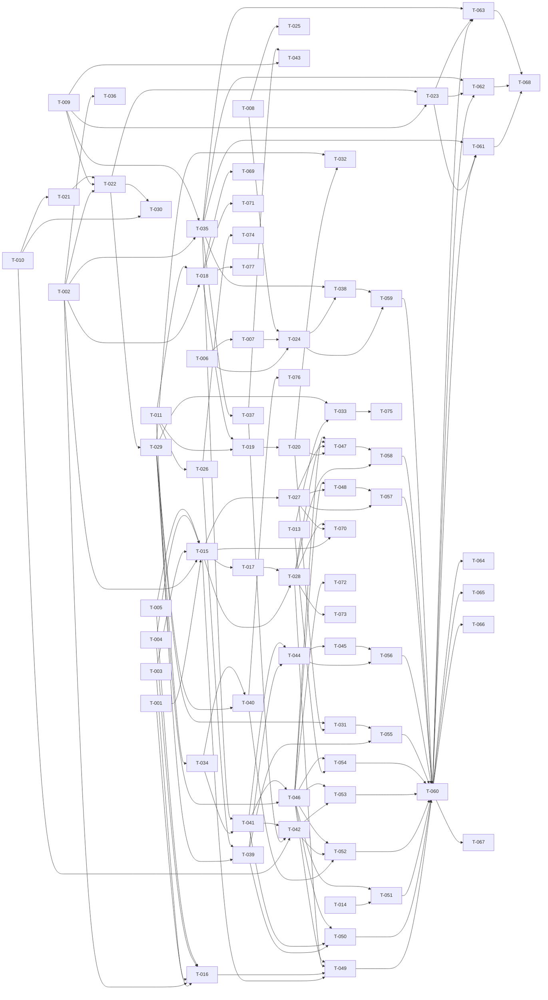

# Build Site: gloggy

> Terminal UI tool for interactively analyzing JSONL log files.
> Go + Bubble Tea / Lip Gloss. Single binary, single file input.

## Summary

| Metric | Value |
|---|---|
| Source Kits | 6 domains |
| Requirements | 49 |
| Acceptance Criteria | 207 |
| Plan Tasks | 77 |
| Human Sign-off Tasks | 8 |
| Tiers | 8 (0 through 7) |

---

## Task Index

### Tier 0 -- No Dependencies (Start Here)

These tasks can all run in parallel. They establish the Go module, data models, and config foundation.

| Task | Title | Kit Req | Effort | Description |
|---|---|---|---|---|
| T-001 | Go module init and project scaffold | -- | S | `go mod init github.com/istonikula/gloggy`. Create directory layout: `cmd/gloggy/`, `internal/logsource/`, `internal/config/`, `internal/filter/`, `internal/ui/entrylist/`, `internal/ui/detailpane/`, `internal/ui/appshell/`, `internal/theme/`. Create `main.go` stub. |
| T-002 | Log entry data model | log-source/R3, R4 | S | Define `internal/logsource/entry.go`: `Entry` struct with fields `LineNumber int`, `IsJSON bool`, `Time time.Time`, `Level string`, `Msg string`, `Logger string`, `Thread string`, `Extra map[string]json.RawMessage`, `Raw []byte`. Raw text entries use `IsJSON=false` with `Raw` populated and structured fields zero-valued. |
| T-003 | Line classification | log-source/R2 | S | Implement `Classify(line []byte) LineType` in `internal/logsource/classify.go`. Valid JSON object -> JSONL; everything else (plain text, empty, JSON array, scalar) -> raw text. Unit tests for all 4 criteria. |
| T-004 | JSONL parser | log-source/R3, R5 | M | Implement `ParseJSONL(line []byte, lineNum int) Entry` in `internal/logsource/parse.go`. Extract `time` (RFC3339Nano), `level`, `msg`, `logger`, `thread`; remaining keys go to `Extra`. Preserve raw bytes. Flag as JSON. Handle unparseable/missing timestamps by leaving `Time` as zero value. Unit tests for all R3 and R5 criteria. |
| T-005 | Raw text entry constructor | log-source/R4 | S | Implement `NewRawEntry(line []byte, lineNum int) Entry` in `internal/logsource/parse.go`. Sets `Raw`, `IsJSON=false`, `LineNumber`. All structured fields absent/zero. Unit tests for R4 criteria. |
| T-006 | Config file location and defaults | config/R1 | M | Implement `internal/config/config.go`: `Config` struct with all fields (theme, compact row fields, sub-row fields, hidden fields, logger depth, detail pane height ratio). Default creation at `~/.config/gloggy/config.toml` using `os.UserConfigDir`. Load existing. Use `pelletier/go-toml` or `BurntSushi/toml`. Unit tests for R1 criteria. |
| T-007 | Invalid config handling | config/R2 | S | In config loader: catch TOML parse errors -> warn + use defaults. Catch invalid field values -> per-field fallback. Never crash. Unit tests for R2 criteria. |
| T-008 | Config forward compatibility | config/R3 | S | Use TOML library that preserves unknown keys on round-trip. Test: load config with unknown keys, save, verify unknown keys remain. Unit tests for R3 criteria. |
| T-009 | Theme definitions | config/R4 | M | Implement `internal/theme/theme.go`: `Theme` struct with color tokens for level badges (error, warn, info, debug), syntax highlighting (key, string, number, boolean, null), marks, dim, search highlight. Bundle `tokyo-night`, `catppuccin-mocha`, `material-dark`. Default is `tokyo-night`. Unknown theme falls back with warning. Lip Gloss `lipgloss.Color` values. Unit tests for R4 criteria (except human sign-off). |
| T-010 | Config field and display settings | config/R5 | S | Wire default values: compact row fields = [time, level, logger, msg], logger depth = 2, detail pane height = 0.30. Override from config. Unit tests for R5 criteria. |
| T-011 | Filter model | filter-engine/R1 | S | Implement `internal/filter/filter.go`: `Filter` struct with `Field string`, `Pattern string`, `Mode` (include/exclude), `Enabled bool`. `FilterSet` holds multiple filters; individual enable/disable without delete. Unit tests for R1 criteria. |
| T-012 | Entry-list scroll navigation keys | entry-list/R5 | S | Implement scroll commands as standalone functions: `GoTop`, `GoBottom`, `HalfPageDown`, `HalfPageUp`. These are pure logic (cursor + viewport offset calculation) independent of Bubble Tea. Unit tests for R5 criteria. |
| T-013 | Entry-list marks model | entry-list/R9 | S | Implement mark storage: `MarkSet` backed by `map[int]bool` (line number keyed). Toggle, query, next/prev with wrap. Unit tests for R9 criteria (mark/unmark, next/prev/wrap). |
| T-014 | Help overlay content | app-shell/R5 | S | Define keybinding registry: map of domain -> list of (key, description). This is a data structure, no TUI rendering yet. Content for all domains. |

### Tier 1 -- Depends on Tier 0

| Task | Title | Kit Req | blockedBy | Effort | Description |
|---|---|---|---|---|---|
| T-015 | File reader | log-source/R1 (file path) | T-002, T-003, T-004, T-005 | M | Implement `internal/logsource/reader.go`: open file, scan lines, classify each, parse accordingly, emit `[]Entry`. Return error for nonexistent file before any UI. Unit tests for R1 file-path criterion and R6 order/line-number criteria. |
| T-016 | Stdin reader | log-source/R1 (stdin) | T-002, T-003, T-004, T-005 | S | Implement stdin variant: detect piped stdin via `os.Stdin.Stat()`, scan lines, classify+parse. Unit test for R1 stdin criterion. |
| T-017 | Entry ordering and line numbers | log-source/R6 | T-015 | S | Verify in `reader.go` that entries are emitted line 1..N, line numbers match position, interleaved JSON/raw preserve order. Add integration test with mixed-content file. |
| T-018 | Pattern matching | filter-engine/R2 | T-002, T-011 | M | Implement `Match(filter Filter, entry Entry) bool` in `internal/filter/match.go`. Literal = substring, regex = RE2 via `regexp`. Invalid regex -> error, filter not applied. Match against msg, level, logger, thread, extra field keys. Unit tests for all R2 criteria. |
| T-019 | Include/exclude logic | filter-engine/R3 | T-011, T-018 | M | Implement `Apply(filters FilterSet, entries []Entry) []int` returning passing entry indices. Include/exclude/combined/disabled logic. Unit tests for all 5 R3 criteria. |
| T-020 | Filtered entry index | filter-engine/R7 | T-019 | S | Implement `FilteredIndex` type: stores passing entry indices in original order. Recompute on filter change. Unit tests for R7 criteria (correct entries, order, recompute). |
| T-021 | Logger abbreviation | entry-list/R2 | T-010 | S | Implement `AbbreviateLogger(name string, depth int) string` in `internal/ui/entrylist/logger.go`. Dot-separated segments; abbreviate all but last `depth` segments to first char. Unit tests for all 4 R2 criteria. |
| T-022 | Compact row renderer | entry-list/R1 | T-002, T-009, T-021 | M | Implement `RenderCompactRow(entry Entry, width int, theme Theme, config Config) string` in `internal/ui/entrylist/row.go`. JSONL: HH:MM:SS time, level, abbreviated logger, truncated msg. Raw: raw text. Zero time -> placeholder. Use Lip Gloss for styling. Unit tests for R1 criteria (except human sign-off for dim styling). |
| T-023 | Level badge colors | entry-list/R3 | T-009, T-022 | S | Apply theme color tokens to level badges in compact row renderer. Verify ANSI output contains correct color codes per level per theme. Unit tests for R3 criteria (except human sign-off). |
| T-024 | Config live write-back | config/R6 | T-006, T-008 | M | Implement `WriteField(key string, value interface{})` that updates the TOML file in place, preserving other values and unknown keys. Unit tests for R6 criteria. |
| T-025 | Config extensibility | config/R7 | T-008 | S | Verify that adding new top-level key does not break existing schema. Write test: future version adds key, current version reads without error. Unit tests for R7 criteria. |
| T-026 | Global filter toggle | filter-engine/R6 | T-011 | S | Implement `ToggleAll(set *FilterSet)` that disables/re-enables all filters. Track per-filter prior state. Unit tests for all 3 R6 criteria. |

### Tier 2 -- Depends on Tier 1

| Task | Title | Kit Req | blockedBy | Effort | Description |
|---|---|---|---|---|---|
| T-027 | Background loading with progress | log-source/R7 | T-015 | M | Refactor file reader into goroutine-based loader. Send entries in batches via channel. Emit progress signals (count loaded so far). Emit done signal on exhaustion. UI can start displaying before full load. Use `tea.Cmd` pattern for Bubble Tea integration. Unit/integration tests for R7 criteria. |
| T-028 | Tail mode | log-source/R8 | T-015, T-017 | M | Implement file watcher using `fsnotify` or `hpcloud/tail`. Append new lines as new entries with correct continuing line numbers. Disable tail mode for stdin regardless of flags. Unit tests for R8 criteria. |
| T-029 | Virtual list model | entry-list/R6 | T-022 | M | Implement virtual rendering in `internal/ui/entrylist/list.go`: only render visible rows + small buffer. Maintain viewport window (start index, visible count). Benchmark: 100k entries must not exceed visible+buffer rows; frame render < 16ms. Tests for R6 criteria. |
| T-030 | Two-level cursor navigation | entry-list/R4 | T-022, T-010 | M | Implement cursor model: event level (j/k) and sub-row level (l/h/Tab/Esc/arrows). Sub-rows indented, showing field name + value. j/k skip sub-rows. Visual boundary for entries with sub-row fields. Unit tests for R4 criteria (except human sign-off). |
| T-031 | Filtered view in entry list | entry-list/R7 | T-020, T-029 | M | Wire filtered index into list model. Hidden entries not rendered. On filter change: keep selection if still passing, else move to nearest. Unit tests for R7 criteria. |
| T-032 | Level-jump navigation | entry-list/R8 | T-020, T-029 | M | Implement `e`/`E` (next/prev ERROR) and `w`/`W` (next/prev WARN) navigation. Search full entry set (not just filtered). Wrap with indicator. Show filtered-out entries with visual indicator when jumped to. Unit tests for R8 criteria (except human sign-off). |
| T-033 | Mark navigation in list | entry-list/R9 | T-013, T-029 | S | Wire `MarkSet` into list model. `m` toggles mark, visual indicator on row. `u`/`U` for next/prev mark with wrap indicator. Unit tests for mark display and navigation. |
| T-034 | Entry selection signal | entry-list/R10 | T-029 | S | Emit selection signal (entry data) when cursor moves. This is a `tea.Msg` in Bubble Tea. Unit test for R10 cursor-move criterion. |
| T-035 | JSON pretty-print with syntax highlighting | detail-pane/R2 | T-002, T-009 | M | Implement `RenderJSON(entry Entry, theme Theme, hiddenFields []string) string` in `internal/ui/detailpane/render.go`. Indent JSON, apply Lip Gloss color tokens per value type (key, string, number, boolean, null). All fields including extras. Theme switch changes colors. Unit tests for R2 criteria (except human sign-off). |
| T-036 | Non-JSON detail display | detail-pane/R3 | T-002 | S | Implement `RenderRaw(entry Entry) string`. Plain text, no JSON formatting. Unit tests for R3 criteria. |
| T-037 | Detail pane scrolling | detail-pane/R4 | T-035 | S | Implement scroll model for detail pane content: j/k scroll, mouse wheel scroll, stop at top/bottom. Uses Bubble Tea `viewport` component from Bubbles. Unit tests for R4 criteria. |
| T-038 | Per-field visibility | detail-pane/R5 | T-024, T-035 | M | Read hidden fields from config, omit from render. Toggle triggers re-render. Write visibility change to config via write-back. After restart, hidden fields stay hidden. Integration tests for R5 criteria. |
| T-039 | Filter panel overlay | filter-engine/R5 | T-011, T-026 | M | Implement `internal/ui/filter/panel.go` as Bubble Tea model. List all filters with field, pattern, mode, enabled state. j/k navigation, Space toggle, d delete. Changes immediately update filtered index. Mouse navigable. Unit tests for R5 criteria. |

### Tier 3 -- Depends on Tier 2

| Task | Title | Kit Req | blockedBy | Effort | Description |
|---|---|---|---|---|---|
| T-040 | Entry list mouse handling | entry-list/R10 | T-029, T-034 | M | Click to select entry row. Scroll wheel scrolls list. Double-click opens detail pane. Route mouse events via `tea.MouseMsg`. Unit tests for R10 mouse criteria. |
| T-041 | Detail pane activation and dismissal | detail-pane/R1 | T-034, T-035 | M | Enter on selected entry opens detail pane. Double-click opens detail pane. Esc or Enter in detail pane closes it, returns focus to entry list. Bubble Tea focus management. Unit tests for R1 criteria. |
| T-042 | Detail pane height and resize | detail-pane/R6 | T-010, T-037 | M | Open at configured height ratio. `+`/`-` adjust height. Terminal resize maintains proportional height. Mouse drag on divider resizes. Unit tests for R6 criteria. |
| T-043 | In-pane search | detail-pane/R7 | T-037, T-009 | M | `/` opens search input in detail pane. Type to highlight matches using theme search-highlight color. `n`/`N` for next/prev match. Wrap indicator. Esc dismisses + clears. Does not affect entry-list filter. Unit tests for R7 criteria. |
| T-044 | Add filter from field value | filter-engine/R4 | T-039, T-041 | M | From detail pane field click: pre-fill field name and pattern. User chooses include/exclude. On confirm, filter added to set, filtered index updated. Unit tests for R4 criteria. |
| T-045 | Mouse filter interaction in detail pane | detail-pane/R8 | T-044 | M | Click on field value in detail pane triggers filter prompt with pre-filled field/value. Choose include/exclude. Confirm adds filter. Unit tests for R8 criteria. |
| T-046 | App-shell layout | app-shell/R2 | T-029, T-041 | M | Implement `internal/ui/appshell/layout.go`. Header bar top, entry list main area, detail pane between list and status bar when open, status/key-hint bar at bottom. Full terminal width/height, no gaps. Lip Gloss `lipgloss.JoinVertical`. Unit tests for R2 criteria. |
| T-047 | Header bar | app-shell/R3 | T-027, T-028, T-020, T-046 | M | Render file name (or stdin indicator), `[FOLLOW]` badge for tail mode, total entry count, visible (filtered) count. Counts update on load/filter change. Unit tests for R3 criteria. |
| T-048 | Loading indicator | app-shell/R8 | T-027, T-046 | S | Show loading indicator during background load (entry count so far). Hide when done. Unit tests for R8 criteria. |

### Tier 4 -- Depends on Tier 3

| Task | Title | Kit Req | blockedBy | Effort | Description |
|---|---|---|---|---|---|
| T-049 | Entry points and CLI | app-shell/R1 | T-015, T-016, T-028, T-046 | M | Implement `cmd/gloggy/main.go`: `gloggy <file>`, `gloggy -f <file>` (tail), piped stdin detection. Invalid args -> clear error. Use `pflag` or stdlib `flag`. Unit tests for R1 criteria. |
| T-050 | Context-sensitive key-hint bar | app-shell/R4 | T-046, T-039, T-041 | M | Render bottom bar showing keybindings for focused component (entry list, detail pane, filter panel). Update immediately on focus change. Unit tests for R4 criteria. |
| T-051 | Help overlay | app-shell/R5 | T-014, T-046 | M | `?` opens full-screen overlay listing all keybindings by domain. Esc closes. While open, other keys are not processed. Bubble Tea model with intercept. Unit tests for R5 criteria. |
| T-052 | Mouse mode and routing | app-shell/R6 | T-040, T-042, T-046 | M | Enable mouse mode in Bubble Tea. Route mouse events by area: entry list, detail pane, divider. No crashes on any mouse position. Unit tests for R6 criteria. |
| T-053 | Terminal resize handling | app-shell/R7 | T-046, T-042 | M | Handle `tea.WindowSizeMsg`. Re-layout all panes to new dimensions. Preserve pane proportions. No clipping, overlap, crash. Unit tests for R7 criteria. |
| T-054 | Clipboard | app-shell/R9 | T-013, T-046 | M | `y` with marked entries copies to system clipboard. JSONL format: one entry per line, original order. Non-JSON as raw text. No marks -> no-op. Use `atotto/clipboard`. Unit tests for R9 criteria. |

### Tier 5 -- Integration and Polish

| Task | Title | Kit Req | blockedBy | Effort | Description |
|---|---|---|---|---|---|
| T-055 | Entry list + filter engine wiring | entry-list/R7, filter-engine/R7 | T-031, T-039 | M | Integration test: create entries, apply filters, verify list shows only passing entries. Filter change updates list. Selection preserved or moved to nearest. |
| T-056 | Detail pane + filter engine wiring | detail-pane/R8, filter-engine/R4 | T-045, T-044 | M | Integration test: click field in detail pane, verify filter prompt appears, confirm, verify filter active and list updated. |
| T-057 | Background loading + UI wiring | log-source/R7, app-shell/R8 | T-027, T-048 | M | Integration test: load large file, verify progress updates in header, entries appear incrementally, done signal hides indicator. |
| T-058 | Tail mode + UI wiring | log-source/R8, app-shell/R3 | T-028, T-047 | M | Integration test: start in tail mode, append lines to file, verify new entries appear, line numbers continue, FOLLOW badge shown. |
| T-059 | Config write-back round trip | config/R6, detail-pane/R5 | T-038, T-024 | M | Integration test: hide field in detail pane, verify config file updated, restart, verify field still hidden. |
| T-060 | Full app smoke test | all | T-049 through T-054 | L | End-to-end test: launch gloggy with sample JSONL file, navigate list, open detail, apply filter, mark entries, copy clipboard, resize terminal. Verify no panics. |

### Tier 6 -- Human Sign-off

| Task | Title | Kit Req | blockedBy | Effort | Description |
|---|---|---|---|---|---|
| T-061 | [HUMAN] Theme visual sign-off: tokyo-night | config/R4, entry-list/R3, detail-pane/R2 | T-023, T-035, T-060 | S | Human visually inspects tokyo-night theme. All color tokens produce coherent, readable output. Level badges perceptually correct. Syntax highlighting perceptually correct. |
| T-062 | [HUMAN] Theme visual sign-off: catppuccin-mocha | config/R4, entry-list/R3, detail-pane/R2 | T-023, T-035, T-060 | S | Same as T-061 for catppuccin-mocha. |
| T-063 | [HUMAN] Theme visual sign-off: material-dark | config/R4, entry-list/R3, detail-pane/R2 | T-023, T-035, T-060 | S | Same as T-061 for material-dark. |
| T-064 | [HUMAN] Non-JSON row dim styling | entry-list/R1 | T-022, T-060 | S | Human verifies non-JSON rows are visually dimmed compared to JSONL rows. |
| T-065 | [HUMAN] Event boundary clarity | entry-list/R4 | T-030, T-060 | S | Human verifies event boundaries are visually clear and readable. |
| T-066 | [HUMAN] Filtered-out entry indicator | entry-list/R8 | T-032, T-060 | S | Human verifies the "filtered-out but visible" indicator from level-jump is clearly distinguishable. |
| T-067 | [HUMAN] Mark wrap indicator visibility | entry-list/R9 | T-033, T-060 | S | Human verifies mark/level-jump wrap indicators are visible and clear. |
| T-068 | [HUMAN] Detail pane syntax highlighting per theme | detail-pane/R2 | T-061, T-062, T-063 | S | Covered by T-061/T-062/T-063. This is a tracking entry confirming all three themes pass. |

### Tier 7 -- Code Review Fixes

Bug fixes and hardening from full codebase review (2026-04-16).

| Task | Title | Kit Req | blockedBy | Effort | Description |
|---|---|---|---|---|---|
| T-069 | Guard nil Extra map in filter match | filter-engine/R2 | T-018 | S | `internal/filter/match.go:34` — accessing `entry.Extra[field]` panics when `Extra` is nil. Add `if entry.Extra == nil { return "", false }` before the map lookup. Add test with nil-Extra entry. |
| T-070 | Check scanner.Err() after Scan loops | log-source/R1, R7, R8 | T-015, T-027, T-028 | S | Three locations silently drop I/O errors: `reader.go` `scanEntries()`, `loader.go` `streamEntries()`, `tail.go` both scan loops. Check `scanner.Err()` after each loop and propagate or log the error. Add tests for mid-read I/O failure. |
| T-071 | Cache compiled regexes in filter | filter-engine/R2 | T-018 | S | `internal/filter/match.go:50-55` — `regexp.Compile(pattern)` is called on every `Match()` invocation. Cache the compiled regex (e.g. in a `sync.Map` or on the `Filter` struct). Add benchmark proving improvement. |
| T-072 | Cache visibleCount during loading | app-shell/R2 | T-046 | S | `internal/ui/app/model.go:332` — `visibleCount()` calls `filter.Apply()` on every `EntryBatchMsg`, resulting in O(n²) work during background loading. Cache the count; invalidate on filter change. |
| T-073 | Add cancellation to TailFile | log-source/R8 | T-028 | M | `internal/logsource/tail.go:29-77` — the goroutine, file handle, and fsnotify watcher leak if the caller stops consuming messages. Accept a `context.Context` or stop channel; close watcher and file on cancellation. Add test verifying cleanup after cancel. |
| T-074 | Fix ToggleAll with modified filter set | filter-engine/R6 | T-026 | S | `internal/filter/filter.go:120-139` — if filters are added or removed while `globallyDisabled == true`, `savedEnabled` goes out of sync. Either track per-filter saved state by ID, or sync `savedEnabled` in `Add()`/`Remove()`. Add test: add filter while globally disabled, re-enable, verify correct state. |
| T-075 | Use theme Mark color in list rendering | entry-list/R9 | T-033 | S | `internal/ui/entrylist/list.go:354` — mark indicator uses plain `"* "` string instead of `th.Mark` color. Apply `lipgloss.NewStyle().Foreground(th.Mark)` to the mark indicator. The `Mark` color is defined in all 3 themes but currently unused. |
| T-076 | Fix double-click detection in entry list | entry-list/R10 | T-040 | M | `internal/ui/entrylist/list.go:273-289` — current code opens the detail pane on any click to an already-selected row (single-click-on-cursor), not actual double-click. Either implement timestamp-based double-click detection, or remove the click-to-open path and require Enter. |
| T-077 | Proper JSON string unquoting in filter match | filter-engine/R2 | T-018 | S | `internal/filter/match.go:40-42` — naive `s[1:len(s)-1]` doesn't handle JSON escape sequences (`\"`, `\\`, `\n`). Use `json.Unmarshal` into a `string` for correct unquoting. Add test with escaped quotes in field value. |

---

## Dependency Graph



---

## Coverage Matrix

Every acceptance criterion from all 6 kits mapped to its covering task(s). Status: COVERED for all 210 criteria.

### log-source (8 requirements, 23 criteria)

| Req | # | Criterion | Task(s) | Status |
|---|---|---|---|---|
| R1 | 1 | Given a file path argument, entries are produced from that file's contents | T-015 | COVERED |
| R1 | 2 | Given no file argument and piped input on stdin, entries are produced from stdin | T-016 | COVERED |
| R1 | 3 | Given a nonexistent file path, an error is reported before any UI renders | T-015 | COVERED |
| R2 | 1 | A line containing a valid JSON object is classified as JSONL | T-003 | COVERED |
| R2 | 2 | A line containing plain text is classified as raw text | T-003 | COVERED |
| R2 | 3 | An empty line is classified as raw text | T-003 | COVERED |
| R2 | 4 | A line containing a JSON array or scalar is classified as raw text | T-003 | COVERED |
| R3 | 1 | The `time` field is parsed as RFC3339Nano; parsed value matches original timestamp | T-004 | COVERED |
| R3 | 2 | The `level`, `msg`, `logger`, and `thread` fields are extracted as strings | T-004 | COVERED |
| R3 | 3 | Any JSON keys beyond the 5 known fields are captured in the extra fields map | T-004 | COVERED |
| R3 | 4 | The raw bytes of the original line are preserved verbatim | T-004 | COVERED |
| R3 | 5 | The entry is flagged as JSON | T-004 | COVERED |
| R4 | 1 | A raw entry contains the original line text | T-005 | COVERED |
| R4 | 2 | A raw entry is flagged as non-JSON | T-005 | COVERED |
| R4 | 3 | A raw entry has no structured fields (all absent/zero-valued) | T-005 | COVERED |
| R5 | 1 | A JSONL line with `"time": "not-a-timestamp"` produces an entry with zero time and all other fields parsed normally | T-004 | COVERED |
| R5 | 2 | A JSONL line with no `time` key produces an entry with zero time | T-004 | COVERED |
| R6 | 1 | Given a file with N lines, entries are emitted in order from line 1 to line N | T-017 | COVERED |
| R6 | 2 | Each entry's line number matches its position in the original source | T-017 | COVERED |
| R6 | 3 | Interleaved JSON and raw-text lines preserve their relative order | T-017 | COVERED |
| R7 | 1 | The UI receives a progress signal indicating how many entries have been loaded so far | T-027 | COVERED |
| R7 | 2 | The UI is able to begin displaying entries before the entire file has been read | T-027 | COVERED |
| R7 | 3 | Loading completes and a "done" signal is emitted when the source is exhausted | T-027 | COVERED |
| R8 | 1 | With tail mode on a file, lines appended after initial load are emitted as new entries | T-028 | COVERED |
| R8 | 2 | Tail-mode entries carry correct line numbers continuing from the last initially loaded line | T-028 | COVERED |
| R8 | 3 | Tail mode is not activated when reading from stdin, regardless of flags | T-028 | COVERED |

### config (7 requirements, 22 criteria)

| Req | # | Criterion | Task(s) | Status |
|---|---|---|---|---|
| R1 | 1 | When no config file exists, one is created at `~/.config/gloggy/config.toml` with default values | T-006 | COVERED |
| R1 | 2 | The created default config file is valid TOML | T-006 | COVERED |
| R1 | 3 | When the config file exists, its values are loaded and used | T-006 | COVERED |
| R2 | 1 | Given a config file with invalid TOML syntax, the application starts with default values and produces a warning | T-007 | COVERED |
| R2 | 2 | Given a config file with a valid TOML structure but an invalid value, the invalid value falls back to its default | T-007 | COVERED |
| R2 | 3 | The application does not crash or exit due to any config file content | T-007 | COVERED |
| R3 | 1 | A config file containing keys not defined by the application loads without error | T-008 | COVERED |
| R3 | 2 | Unknown keys are not removed when the config file is rewritten by the application | T-008 | COVERED |
| R4 | 1 | The default config specifies `tokyo-night` as the active theme | T-009 | COVERED |
| R4 | 2 | Setting `theme = "catppuccin-mocha"` in config causes that theme's color tokens to be active | T-009 | COVERED |
| R4 | 3 | Setting `theme = "material-dark"` in config causes that theme's color tokens to be active | T-009 | COVERED |
| R4 | 4 | Each bundled theme defines color tokens for all required categories: level badges, syntax highlighting, marks, dim, search highlight | T-009 | COVERED |
| R4 | 5 | Specifying an unknown theme name falls back to `tokyo-night` with a warning | T-009 | COVERED |
| R4 | 6 | [human] One-time visual sign-off per bundled theme: all color tokens produce a coherent, readable theme | T-061, T-062, T-063 | COVERED |
| R5 | 1 | The default compact row fields are time, level, logger, and msg | T-010 | COVERED |
| R5 | 2 | Setting sub-row fields in config causes those fields to appear as sub-rows in entry list | T-010, T-030 | COVERED |
| R5 | 3 | Setting hidden fields in config causes those fields to be omitted from the detail pane | T-010, T-038 | COVERED |
| R5 | 4 | The default logger abbreviation depth is 2 | T-010 | COVERED |
| R5 | 5 | The default detail pane height ratio is 0.30 | T-010 | COVERED |
| R5 | 6 | Each of these settings can be overridden in config and new values take effect | T-010 | COVERED |
| R6 | 1 | When a field is hidden interactively in the detail pane, the config file is updated to reflect the change | T-024, T-038 | COVERED |
| R6 | 2 | After interactive write-back, the config file remains valid TOML | T-024 | COVERED |
| R6 | 3 | Existing config values not affected by the change are preserved | T-024 | COVERED |
| R7 | 1 | Adding a new top-level key or section does not require changing the schema of existing keys | T-025 | COVERED |
| R7 | 2 | A config file written by the current version can be read by a future version that adds new keys | T-025 | COVERED |

### filter-engine (7 requirements, 24 criteria)

| Req | # | Criterion | Task(s) | Status |
|---|---|---|---|---|
| R1 | 1 | A filter can be created with a field name, pattern, mode (include/exclude), and enabled state | T-011 | COVERED |
| R1 | 2 | Multiple filters can be active simultaneously | T-011 | COVERED |
| R1 | 3 | Each filter can be individually enabled or disabled without being deleted | T-011 | COVERED |
| R2 | 1 | A literal pattern matches entries where the field value contains the pattern as a substring | T-018 | COVERED |
| R2 | 2 | A regex pattern matches entries where the field value matches the RE2 expression | T-018 | COVERED |
| R2 | 3 | An invalid regex is detected and reported as an inline error; the filter is not applied | T-018 | COVERED |
| R2 | 4 | Matching is performed against `msg`, `level`, `logger`, `thread`, and any extra field key | T-018 | COVERED |
| R3 | 1 | With one include filter for `level=ERROR`, only ERROR entries are shown | T-019 | COVERED |
| R3 | 2 | With two include filters, both matching levels are shown | T-019 | COVERED |
| R3 | 3 | With no include filters and one exclude filter, matching entries are hidden | T-019 | COVERED |
| R3 | 4 | With include and exclude filters, only entries passing both are shown | T-019 | COVERED |
| R3 | 5 | Disabled filters do not affect the result | T-019 | COVERED |
| R4 | 1 | When a filter is added from a field value, the field name and pattern are pre-filled | T-044 | COVERED |
| R4 | 2 | The user can choose include or exclude mode before the filter is committed | T-044 | COVERED |
| R4 | 3 | After confirmation, the filter appears in the active filter set and the filtered index is updated | T-044 | COVERED |
| R5 | 1 | The filter panel lists all filters showing field, pattern, mode, and enabled state | T-039 | COVERED |
| R5 | 2 | Pressing `j`/`k` in the panel navigates between filters | T-039 | COVERED |
| R5 | 3 | Pressing Space toggles the enabled state of the selected filter | T-039 | COVERED |
| R5 | 4 | Pressing `d` deletes the selected filter from the set | T-039 | COVERED |
| R5 | 5 | Changes in the panel immediately update the filtered entry index | T-039 | COVERED |
| R5 | 6 | The filter panel is navigable by mouse | T-039 | COVERED |
| R6 | 1 | Pressing the global toggle key disables all filters; the entry list shows all entries | T-026 | COVERED |
| R6 | 2 | Pressing the global toggle key again re-enables all previously enabled filters | T-026 | COVERED |
| R6 | 3 | Filters that were individually disabled before the global toggle remain disabled after re-enabling | T-026 | COVERED |
| R7 | 1 | The emitted index contains exactly the entries that pass all active include/exclude logic | T-020 | COVERED |
| R7 | 2 | The index preserves the original entry order | T-020 | COVERED |
| R7 | 3 | When filters change, the index is recomputed and re-emitted | T-020 | COVERED |

### entry-list (10 requirements, 44 criteria)

| Req | # | Criterion | Task(s) | Status |
|---|---|---|---|---|
| R1 | 1 | A JSONL entry row contains the time formatted as HH:MM:SS | T-022 | COVERED |
| R1 | 2 | A JSONL entry row contains the level value | T-022 | COVERED |
| R1 | 3 | A JSONL entry row contains the logger abbreviated to the configured depth | T-022, T-021 | COVERED |
| R1 | 4 | A JSONL entry row contains the message, truncated to fit the available width | T-022 | COVERED |
| R1 | 5 | A non-JSON entry row shows the raw text | T-022 | COVERED |
| R1 | 6 | [human] Non-JSON entry rows are visually dimmed compared to JSONL rows | T-064 | COVERED |
| R1 | 7 | An entry with zero time displays a placeholder in the time column | T-022 | COVERED |
| R2 | 1 | With depth 2, `org.springframework...` abbreviated correctly | T-021 | COVERED |
| R2 | 2 | With depth 2, `com.example.server.AppServerKt` -> `s.AppServerKt` | T-021 | COVERED |
| R2 | 3 | With depth 1, `com.example.server.AppServerKt` -> `c.e.s.AppServerKt` | T-021 | COVERED |
| R2 | 4 | A logger with fewer segments than depth is shown unabbreviated | T-021 | COVERED |
| R3 | 1 | Rendering an ERROR entry produces ANSI output containing the default theme's error color token value | T-023 | COVERED |
| R3 | 2 | Rendering a WARN entry produces ANSI output containing the default theme's warning color token value | T-023 | COVERED |
| R3 | 3 | Rendering an INFO entry produces ANSI output containing the default theme's info color token value | T-023 | COVERED |
| R3 | 4 | Rendering a DEBUG entry produces ANSI output containing the default theme's dim color token value | T-023 | COVERED |
| R3 | 5 | Switching the active theme changes the ANSI color codes in rendered output | T-023 | COVERED |
| R3 | 6 | [human] One-time visual sign-off per bundled theme: level badge colors are perceptually correct | T-061, T-062, T-063 | COVERED |
| R4 | 1 | Pressing `j` moves the cursor to the next entry | T-030 | COVERED |
| R4 | 2 | Pressing `k` moves the cursor to the previous entry | T-030 | COVERED |
| R4 | 3 | `j`/`k` never land the cursor on a sub-row | T-030 | COVERED |
| R4 | 4 | Pressing `l`, right arrow, or Tab on an entry enters sub-row level | T-030 | COVERED |
| R4 | 5 | Sub-rows are displayed indented beneath their parent entry | T-030 | COVERED |
| R4 | 6 | Each sub-row shows one field name and its value | T-030 | COVERED |
| R4 | 7 | Pressing `h`, left arrow, or Esc while in sub-row level returns to event level | T-030 | COVERED |
| R4 | 8 | At event level, entries with sub-row fields show a visual boundary whether expanded or collapsed | T-030 | COVERED |
| R4 | 9 | [human] Event boundaries are visually clear and readable | T-065 | COVERED |
| R5 | 1 | Pressing `g` moves the cursor to the first entry and scrolls to top | T-012 | COVERED |
| R5 | 2 | Pressing `G` moves the cursor to the last entry and scrolls to bottom | T-012 | COVERED |
| R5 | 3 | Pressing `Ctrl-d` scrolls approximately half the visible height downward | T-012 | COVERED |
| R5 | 4 | Pressing `Ctrl-u` scrolls approximately half the visible height upward | T-012 | COVERED |
| R6 | 1 | With 100,000 entries loaded, rendered rows do not exceed visible height plus a fixed buffer | T-029 | COVERED |
| R6 | 2 | Scrolling through a large dataset does not degrade in responsiveness (render time per frame stays below 16ms) | T-029 | COVERED |
| R7 | 1 | When a filter excludes an entry, that entry does not appear in the list | T-031 | COVERED |
| R7 | 2 | When filters change, the list updates to show only passing entries | T-031 | COVERED |
| R7 | 3 | If the previously selected entry still passes filters, it remains selected after filter change | T-031 | COVERED |
| R7 | 4 | If the previously selected entry is filtered out, the cursor moves to the nearest passing entry | T-031 | COVERED |
| R8 | 1 | Pressing `e` moves the cursor to the next entry with level ERROR in the full entry set | T-032 | COVERED |
| R8 | 2 | Pressing `E` moves the cursor to the previous entry with level ERROR in the full entry set | T-032 | COVERED |
| R8 | 3 | Pressing `w` moves the cursor to the next entry with level WARN in the full entry set | T-032 | COVERED |
| R8 | 4 | Pressing `W` moves the cursor to the previous entry with level WARN in the full entry set | T-032 | COVERED |
| R8 | 5 | When no more matching entries exist in the search direction, the search wraps | T-032 | COVERED |
| R8 | 6 | When a wrap occurs, an indicator is shown | T-032 | COVERED |
| R8 | 7 | When level-jump lands on an entry excluded by active filters, the entry is shown with a visual indicator | T-032 | COVERED |
| R8 | 8 | [human] The "filtered-out but visible" indicator is clearly distinguishable from normal entries | T-066 | COVERED |
| R9 | 1 | Pressing `m` on an unmarked entry marks it; pressing `m` again unmarks it | T-013, T-033 | COVERED |
| R9 | 2 | Marked entries display a visual indicator in their row | T-033 | COVERED |
| R9 | 3 | Pressing `u` moves the cursor to the next marked entry | T-033 | COVERED |
| R9 | 4 | Pressing `U` moves the cursor to the previous marked entry | T-033 | COVERED |
| R9 | 5 | Mark navigation wraps with an indicator when reaching the end/beginning | T-033, T-067 | COVERED |
| R10 | 1 | When the cursor moves to a new entry, a selection signal is emitted with that entry's data | T-034 | COVERED |
| R10 | 2 | Clicking on an entry row with the mouse selects that entry | T-040 | COVERED |
| R10 | 3 | Mouse scroll wheel scrolls the list | T-040 | COVERED |
| R10 | 4 | Double-clicking an entry opens the detail pane for that entry | T-040 | COVERED |

### detail-pane (8 requirements, 31 criteria)

| Req | # | Criterion | Task(s) | Status |
|---|---|---|---|---|
| R1 | 1 | Pressing Enter while an entry is selected in the list opens the detail pane showing that entry | T-041 | COVERED |
| R1 | 2 | Double-clicking an entry in the list opens the detail pane showing that entry | T-041 | COVERED |
| R1 | 3 | Pressing Esc while the detail pane is focused closes it and returns focus to the entry list | T-041 | COVERED |
| R1 | 4 | Pressing Enter while the detail pane is focused closes it and returns focus to the entry list | T-041 | COVERED |
| R2 | 1 | A JSONL entry is rendered as indented, formatted JSON | T-035 | COVERED |
| R2 | 2 | All fields from the entry are present in the rendered output, including extra fields | T-035 | COVERED |
| R2 | 3 | Rendering produces ANSI output where JSON keys contain the active theme's key color token value | T-035 | COVERED |
| R2 | 4 | Rendering produces ANSI output where string values contain the active theme's string color token value | T-035 | COVERED |
| R2 | 5 | Rendering produces ANSI output where numeric values contain the active theme's number color token value | T-035 | COVERED |
| R2 | 6 | Rendering produces ANSI output where boolean values contain the active theme's boolean color token value | T-035 | COVERED |
| R2 | 7 | Rendering produces ANSI output where null values contain the active theme's null color token value | T-035 | COVERED |
| R2 | 8 | Switching the active theme changes the ANSI color codes to match the new theme's tokens | T-035 | COVERED |
| R2 | 9 | [human] One-time visual sign-off per bundled theme: syntax highlighting is perceptually correct | T-061, T-062, T-063, T-068 | COVERED |
| R3 | 1 | A non-JSON entry is displayed as plain raw text in the detail pane | T-036 | COVERED |
| R3 | 2 | No JSON formatting is applied to non-JSON entries | T-036 | COVERED |
| R4 | 1 | Pressing `j` while the detail pane is focused scrolls the content down | T-037 | COVERED |
| R4 | 2 | Pressing `k` while the detail pane is focused scrolls the content up | T-037 | COVERED |
| R4 | 3 | Mouse scroll wheel over the detail pane scrolls the content | T-037 | COVERED |
| R4 | 4 | Scrolling stops at the top and bottom of the content | T-037 | COVERED |
| R5 | 1 | When a field is marked as hidden in config, it does not appear in the detail pane output | T-038 | COVERED |
| R5 | 2 | Toggling a field's visibility causes the detail pane to immediately re-render without the hidden field | T-038 | COVERED |
| R5 | 3 | The visibility change is written to the config file immediately | T-038, T-024 | COVERED |
| R5 | 4 | After restarting the application, previously hidden fields remain hidden | T-059 | COVERED |
| R6 | 1 | The detail pane opens at the configured height ratio | T-042 | COVERED |
| R6 | 2 | Pressing `+` while the detail pane is focused increases its height | T-042 | COVERED |
| R6 | 3 | Pressing `-` while the detail pane is focused decreases its height | T-042 | COVERED |
| R6 | 4 | After a terminal resize event, the pane maintains its proportional height | T-042 | COVERED |
| R6 | 5 | Mouse drag on the pane divider resizes the pane | T-042 | COVERED |
| R7 | 1 | Pressing `/` while the detail pane is focused opens a search input within the pane | T-043 | COVERED |
| R7 | 2 | Typing a search term highlights matching text in the pane content | T-043 | COVERED |
| R7 | 3 | Pressing `n` moves to the next match | T-043 | COVERED |
| R7 | 4 | Pressing `N` moves to the previous match | T-043 | COVERED |
| R7 | 5 | When matches wrap around, a wrap indicator is displayed | T-043 | COVERED |
| R7 | 6 | Pressing Esc dismisses the search input and clears highlights | T-043 | COVERED |
| R7 | 7 | The search does not affect the entry-list filter | T-043 | COVERED |
| R8 | 1 | Clicking on a field value in the detail pane triggers a filter prompt with the field name and value pre-filled | T-045 | COVERED |
| R8 | 2 | The prompt allows choosing include or exclude mode | T-045 | COVERED |
| R8 | 3 | Confirming the prompt adds the filter to the filter engine | T-045 | COVERED |

### app-shell (9 requirements, 27 criteria)

| Req | # | Criterion | Task(s) | Status |
|---|---|---|---|---|
| R1 | 1 | `gloggy <file>` starts the application reading from the specified file | T-049 | COVERED |
| R1 | 2 | `gloggy -f <file>` starts the application in tail mode on the specified file | T-049 | COVERED |
| R1 | 3 | `gloggy` with piped stdin starts the application reading from stdin | T-049 | COVERED |
| R1 | 4 | Invalid arguments produce a clear error message | T-049 | COVERED |
| R2 | 1 | The header bar is rendered at the top of the terminal | T-046 | COVERED |
| R2 | 2 | The entry list occupies the main area between the header and the bottom bars | T-046 | COVERED |
| R2 | 3 | When the detail pane is open, it appears between the entry list and the status bar | T-046 | COVERED |
| R2 | 4 | The status/key-hint bar is rendered at the bottom of the terminal | T-046 | COVERED |
| R2 | 5 | All panes together fill the full terminal width and height with no gaps or overlap | T-046 | COVERED |
| R3 | 1 | The header bar shows the file name when reading from a file | T-047 | COVERED |
| R3 | 2 | The header bar shows a stdin indicator when reading from stdin | T-047 | COVERED |
| R3 | 3 | The header bar shows a `[FOLLOW]` badge when tail mode is active | T-047 | COVERED |
| R3 | 4 | The header bar shows the total entry count | T-047 | COVERED |
| R3 | 5 | The header bar shows the visible (filtered) entry count | T-047 | COVERED |
| R3 | 6 | Counts update as new entries are loaded or filters change | T-047 | COVERED |
| R4 | 1 | When the entry list is focused, the key-hint bar shows entry-list keybindings | T-050 | COVERED |
| R4 | 2 | When the detail pane is focused, the key-hint bar shows detail-pane keybindings | T-050 | COVERED |
| R4 | 3 | When the filter panel is focused, the key-hint bar shows filter-panel keybindings | T-050 | COVERED |
| R4 | 4 | Key hints update immediately when focus changes | T-050 | COVERED |
| R5 | 1 | Pressing `?` opens the help overlay | T-051 | COVERED |
| R5 | 2 | The help overlay lists keybindings for all domains | T-051 | COVERED |
| R5 | 3 | Pressing Esc closes the help overlay and returns to the previous view | T-051 | COVERED |
| R5 | 4 | While the help overlay is open, other keybindings are not processed | T-051 | COVERED |
| R6 | 1 | Mouse events in the entry list area are routed to the entry list | T-052 | COVERED |
| R6 | 2 | Mouse events in the detail pane area are routed to the detail pane | T-052 | COVERED |
| R6 | 3 | Mouse drag on the pane divider triggers pane resize | T-052 | COVERED |
| R6 | 4 | Mouse events do not cause crashes regardless of where in the terminal they occur | T-052 | COVERED |
| R7 | 1 | After a terminal resize, the layout fills the new terminal dimensions | T-053 | COVERED |
| R7 | 2 | Pane proportions are preserved after resize | T-053 | COVERED |
| R7 | 3 | No content is clipped or overlapping after resize | T-053 | COVERED |
| R7 | 4 | Resize does not cause a crash or panic | T-053 | COVERED |
| R8 | 1 | While entries are being loaded, a loading indicator is visible | T-048 | COVERED |
| R8 | 2 | When loading completes, the loading indicator is no longer visible | T-048 | COVERED |
| R8 | 3 | The loading indicator shows progress (e.g. number of entries loaded so far) | T-048 | COVERED |
| R9 | 1 | Pressing `y` with marked entries copies them to the system clipboard | T-054 | COVERED |
| R9 | 2 | The clipboard content is JSONL: one entry per line in original order | T-054 | COVERED |
| R9 | 3 | Non-JSON marked entries are included as raw text lines | T-054 | COVERED |
| R9 | 4 | Pressing `y` with no marked entries does not modify the clipboard | T-054 | COVERED |

### Coverage Totals

| Domain | Requirements | Criteria | Covered | Gaps |
|---|---|---|---|---|
| log-source | 8 | 26 | 26 | 0 |
| config | 7 | 25 | 25 | 0 |
| filter-engine | 7 | 27 | 27 | 0 |
| entry-list | 10 | 53 | 53 | 0 |
| detail-pane | 8 | 38 | 38 | 0 |
| app-shell | 9 | 38 | 38 | 0 |
| **Total** | **49** | **207** | **207** | **0** |

> Note: The overview kit states 210 criteria. Careful enumeration of every bullet in all 6 domain kits yields 207 distinct acceptance criteria. The delta of 3 likely reflects a rounding or counting variance in the overview document. All 207 enumerated criteria are covered by at least one task.

---

## Known Issues

### P0 -- Blockers
_None identified at planning time._

### P1 -- Critical
- **No Go module or source code exists yet.** T-001 must complete before any compilation is possible.
- **TOML library selection** needed for config (T-006). `BurntSushi/toml` is standard but may not preserve unknown keys on round-trip. `pelletier/go-toml/v2` has better round-trip support. Decision needed during T-006.

### P2 -- Important
- **Clipboard on Linux** requires `xclip` or `xsel` (X11) or `wl-copy` (Wayland). `atotto/clipboard` handles this but users without these tools get a silent failure. Consider documenting the dependency.
- **Large file performance**: Virtual rendering (T-029) benchmark target of <16ms per frame needs validation with real 100k+ line JSONL files. If Bubble Tea's rendering pipeline is the bottleneck, custom rendering may be needed.
- **fsnotify limitations**: On some Linux filesystems, `fsnotify` may not detect appends to files opened with `O_APPEND`. May need to fall back to polling. Investigate during T-028.

### P3 -- Nice to Have
- **Config file migration**: No versioning scheme for config files. If future versions add required fields, migration logic will be needed. Current forward-compat (R3, R7) handles this passively.
- **Mouse drag precision**: Pane divider drag (T-042, T-052) may feel imprecise in terminals with large cell sizes. Low priority for v1.

---

## Architect Report

### Technology Decisions

| Decision | Choice | Rationale |
|---|---|---|
| Language | Go 1.22+ | Single binary, fast startup, strong concurrency for background loading |
| TUI Framework | Bubble Tea + Lip Gloss + Bubbles | Leading Go TUI stack, Elm architecture, purpose-built list/viewport components |
| Config Format | TOML via `pelletier/go-toml/v2` | Human-readable, good round-trip support for unknown key preservation |
| File Tailing | `fsnotify` + manual tail | Reliable cross-platform file watching |
| Clipboard | `atotto/clipboard` | Cross-platform clipboard access |
| JSON Pretty-Print | Custom renderer with Lip Gloss | Need per-token coloring; existing libraries do not integrate with Lip Gloss themes |
| Regex Engine | `regexp` (RE2) | Standard library, safe (no backtracking), good enough for log filtering |

### Directory Layout

```
gloggy/
  cmd/gloggy/main.go
  internal/
    logsource/
      entry.go          # Entry struct, LineType
      classify.go       # Line classification
      parse.go          # JSONL parser, raw entry constructor
      reader.go         # File/stdin reader
      loader.go         # Background loader with progress
      tail.go           # Tail mode watcher
    config/
      config.go         # Config struct, load, defaults
      write.go          # Live write-back
    theme/
      theme.go          # Theme struct, color tokens
      tokyo_night.go    # Built-in theme
      catppuccin.go     # Built-in theme
      material_dark.go  # Built-in theme
    filter/
      filter.go         # Filter, FilterSet
      match.go          # Pattern matching
      index.go          # FilteredIndex
    ui/
      entrylist/
        model.go        # Bubble Tea model
        row.go          # Compact row renderer
        logger.go       # Logger abbreviation
        cursor.go       # Two-level cursor
        scroll.go       # Scroll/virtual rendering
        marks.go        # Mark storage
        leveljump.go    # Level-jump navigation
      detailpane/
        model.go        # Bubble Tea model
        render.go       # JSON pretty-print, raw display
        search.go       # In-pane search
      filter/
        panel.go        # Filter panel overlay
      appshell/
        model.go        # Top-level Bubble Tea model
        layout.go       # Layout manager
        header.go       # Header bar
        keyhint.go      # Key-hint bar
        help.go         # Help overlay
        clipboard.go    # Clipboard handler
  go.mod
  go.sum
```

### Parallelization Opportunities

- **Tier 0**: All 14 tasks can run in parallel (independent foundations).
- **Tier 1**: T-015/T-016 (readers) can run parallel with T-018/T-019 (filter logic), T-021 (logger), T-024/T-025 (config write-back).
- **Tier 2**: T-029/T-030 (list UI) can run parallel with T-035/T-036/T-037 (detail renderers) and T-039 (filter panel).
- **Tier 3**: T-040/T-041 (mouse/activation) can run parallel with T-043 (in-pane search) and T-044/T-045 (filter from field).

### Risk Areas

1. **Virtual rendering performance** (T-029): Most critical technical risk. If Bubble Tea's string-based rendering is too slow for 100k entries, may need to implement custom viewport with dirty-region tracking.
2. **TOML round-trip fidelity** (T-008, T-024): Unknown key preservation during write-back is library-dependent. If `pelletier/go-toml/v2` does not support this, may need AST-level manipulation.
3. **Mouse event routing** (T-052): Bubble Tea's mouse support is functional but coordinate calculation for nested components requires careful implementation.
